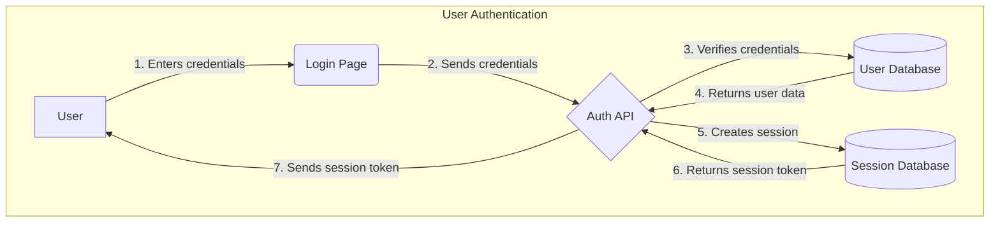
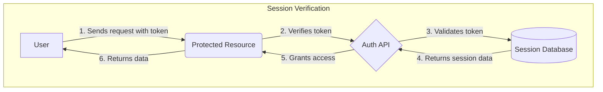

## Auth Data Flow Explanation

This data flow diagram illustrates the user authentication and session
management processes.

### User Authentication Flow

1. **User**: The user initiates the login process by providing their credentials
   (e.g., email and password).
2. **Auth API**: The backend authentication service receives the credentials.
3. **User Database**: The API verifies the credentials against the `user` and
   `account` tables.
4. **Session Database**: Upon successful verification, a new session is created
   in the `session` table, and a unique session token is generated.
5. **Response**: The session token is sent back to the user, who can then use it
   to access protected resources.

### Session Verification Flow

1. **User**: The user makes a request to a protected resource, including the
   session token in the request headers.
2. **Auth API**: The API intercepts the request and extracts the token.
3. **Session Database**: The token is validated against the `session` table to
   ensure it is active and not expired.
4. **Access Control**: If the token is valid, the API grants access to the
   protected resource, which then returns the requested data to the user.
