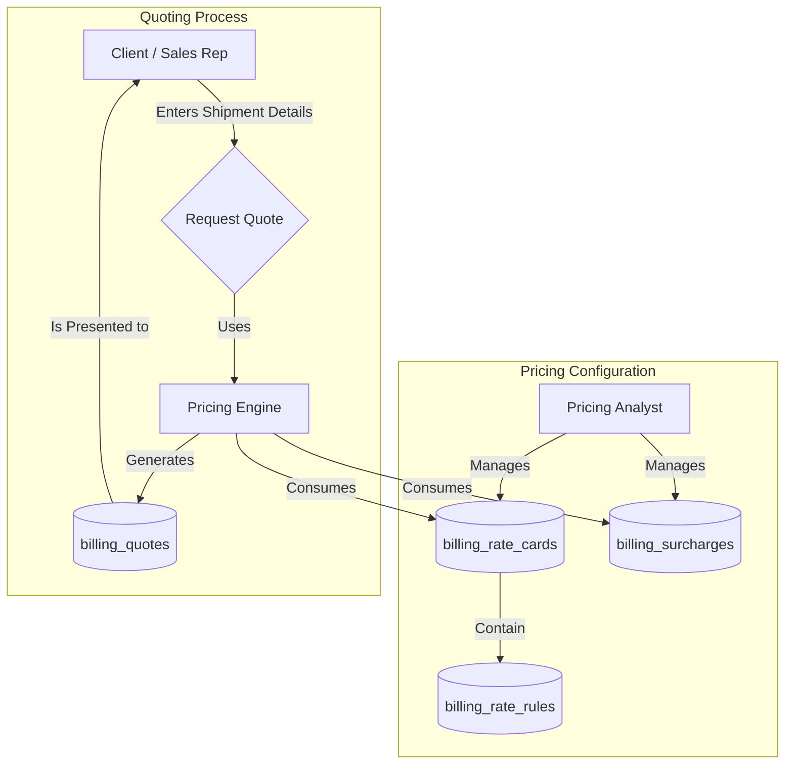
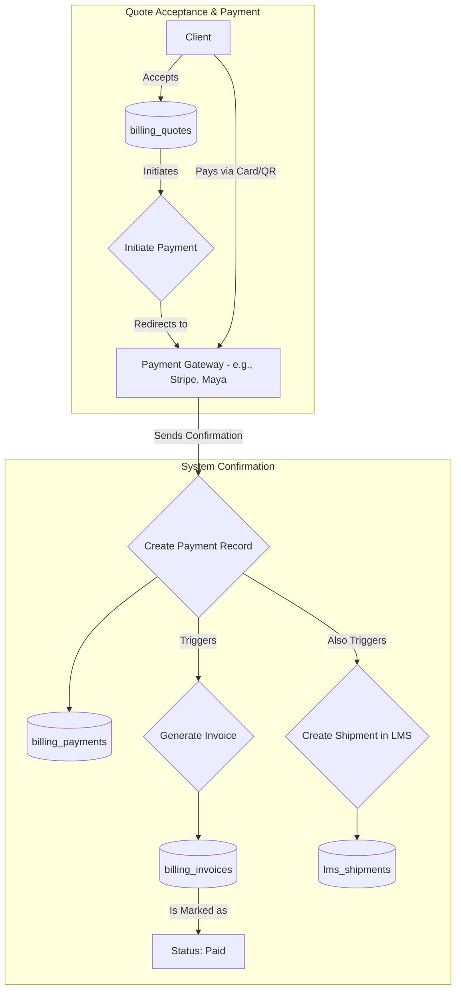
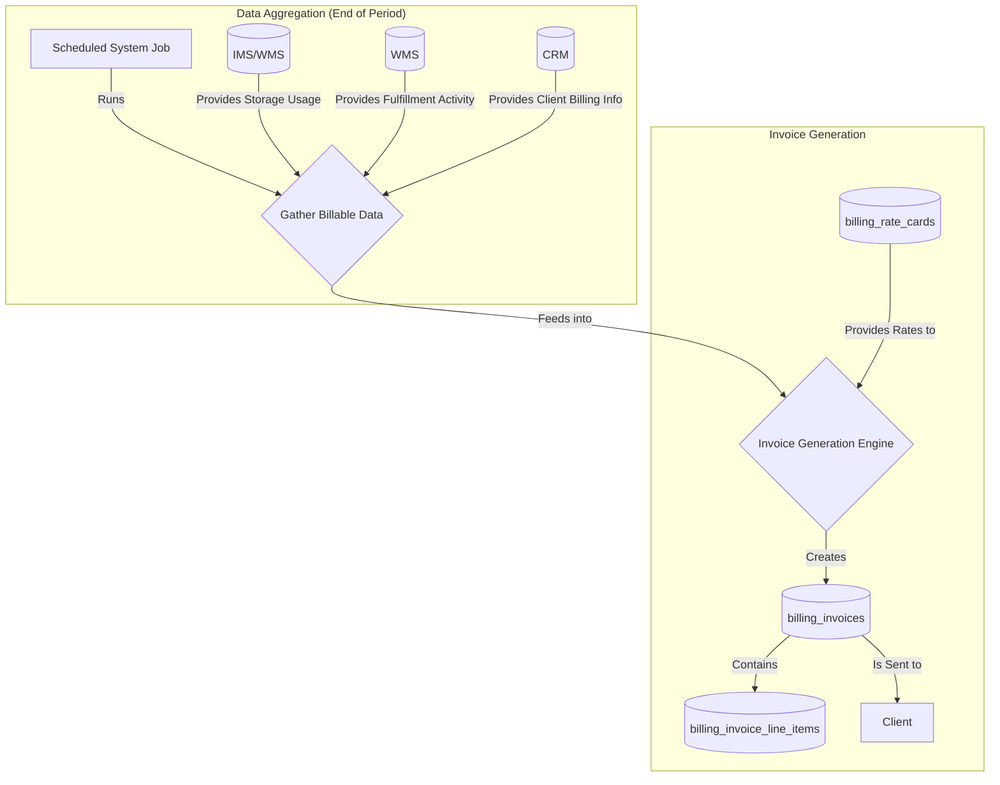
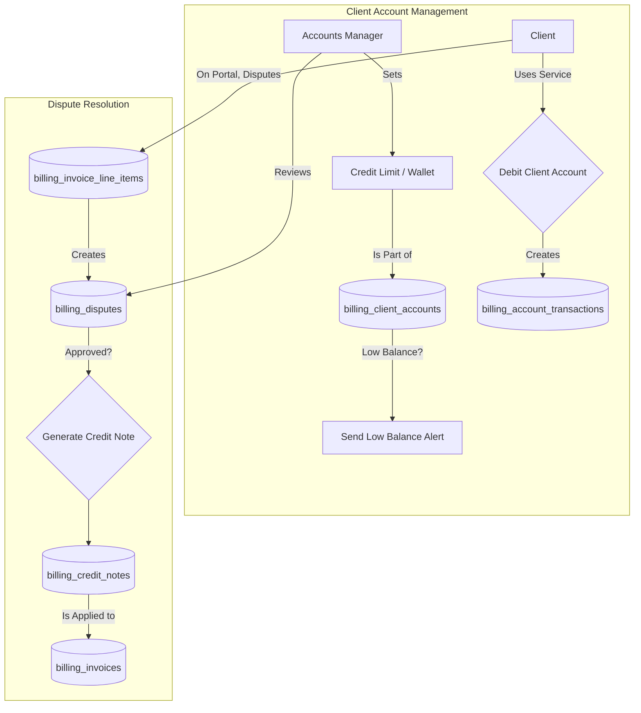
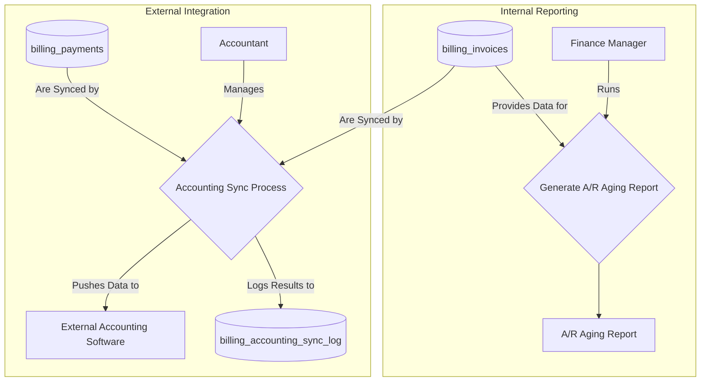
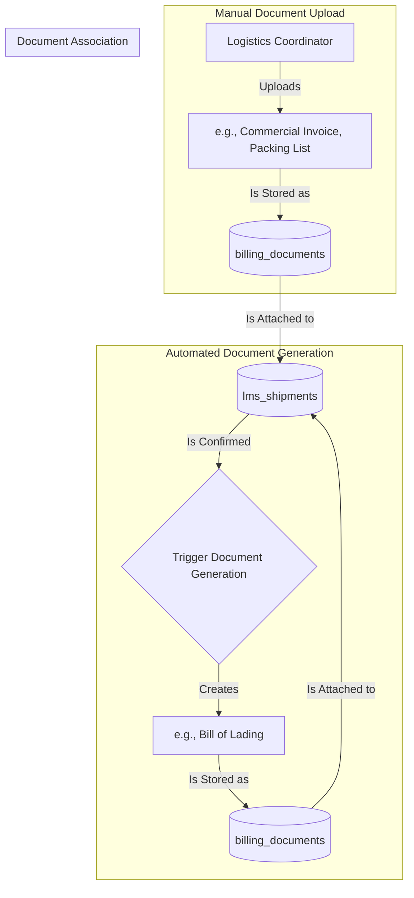

## Billing Data Flow Explanation

This document outlines the data flows within the Billing System, a comprehensive
financial engine that handles everything from initial price quoting to recurring
invoicing, payment processing, and financial reporting.

### Pricing & Quoting Flow

This flow describes how prices are managed and how clients or sales staff can
get instant quotes for services.

- **Pricing Configuration**: A **Pricing Analyst** is responsible for setting up
  and maintaining the core pricing logic. They create **Rate Cards** which
  contain specific **Rate Rules** (e.g., price per kg for Zone A). They also
  manage global **Surcharges** (e.g., fuel, seasonal).
- **Quoting Process**: A **Client** or **Sales Rep** provides shipment details
  (origin, destination, dimensions). The system's **Pricing Engine** uses the
  active rate cards and surcharges to calculate a price and generates a
  **Quote** for the user to review.

### Upfront Payment & Order Creation Flow (Order-to-Cash)

This flow details how a client accepts a quote and pays for it immediately,
triggering the creation of a shipment.

- **Payment**: The **Client** accepts the quote and is redirected to a
  third-party **Payment Gateway** to pay securely.
- **Confirmation**: Upon successful payment, the gateway notifies the system.
- **Record Creation**: The system creates a **Payment** record, generates a
  corresponding **Invoice** and marks it as "Paid," and, crucially, creates the
  actual **Shipment** record in the Logistics Management System (LMS),
  officially starting the delivery process.

### Automated Service & Recurring Billing Flow

This flow describes the automated process for invoicing clients for ongoing
services like storage and fulfillment.

- **Data Aggregation**: At the end of a billing cycle, a **Scheduled System
  Job** runs. It pulls usage data from other systems: storage volume from the
  IMS/WMS and fulfillment activity (picks, packs) from the WMS.
- **Invoice Generation**: The system's **Invoice Generation Engine** processes
  this data, applies the correct rates from the **Rate Cards**, and creates a
  detailed **Invoice**. The invoice contains itemized **Line Items** for each
  charge and is sent to the client's billing contact, whose information is
  sourced from the CRM.

### Client Account & Dispute Management Flow

This flow covers how flexible payment options (credit/wallet) and billing
disputes are handled.

- **Account Management**: An **Accounts Manager** can set a **Credit Limit** or
  enable a pre-paid **Wallet** for a client. When the client uses a service,
  their account is debited via a **Transaction** record. The system can
  automatically notify clients when their wallet balance is low.
- **Dispute Resolution**: A **Client** can dispute a specific **Line Item** on
  an invoice through their portal. This flags the item and creates a **Dispute**
  record. The **Accounts Manager** reviews the dispute. If approved, the system
  generates a **Credit Note**, which is then applied to the original invoice to
  adjust the total amount due.

### Financial Reporting & Integration Flow

This flow describes how financial data is used for internal reporting and
synchronized with external accounting systems.

- **Reporting**: A **Finance Manager** can generate financial reports, such as
  an **Accounts Receivable (A/R) Aging Report**, which pulls data from all
  outstanding **Invoices** to track late payments.
- **Integration**: An automated **Sync Process**, overseen by an **Accountant**,
  pushes all new **Invoices** and **Payments** to the company's external
  **Accounting Software** (e.g., QuickBooks, Xero). The outcome of each
  synchronization attempt is recorded in a **Sync Log**.

### Document Management Flow

This flow illustrates how critical shipping documents are generated and managed
within the system.

- **Automated Generation**: When a **Shipment** is confirmed in the LMS, the
  system automatically generates necessary documents, like a Bill of Lading
  (BOL). This document is pre-filled with shipment data and saved in the
  **Billing Documents** repository.
- **Manual Upload**: A **Logistics Coordinator** can manually upload other
  required files, such as a commercial invoice or a certificate of origin. These
  are also stored as **Billing Documents**.
- **Association**: Both automatically generated and manually uploaded documents
  are linked directly to the corresponding shipment record, ensuring all
  paperwork is centralized and easily accessible for compliance, auditing, or
  customer service purposes.
