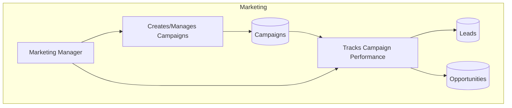
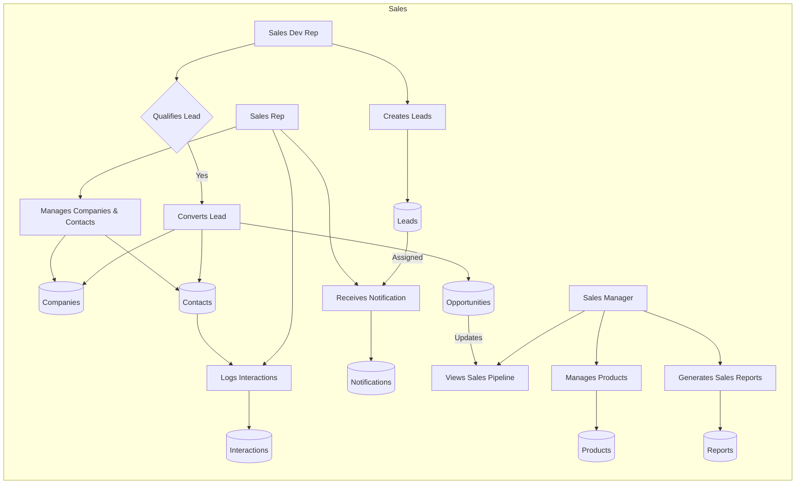
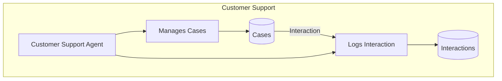
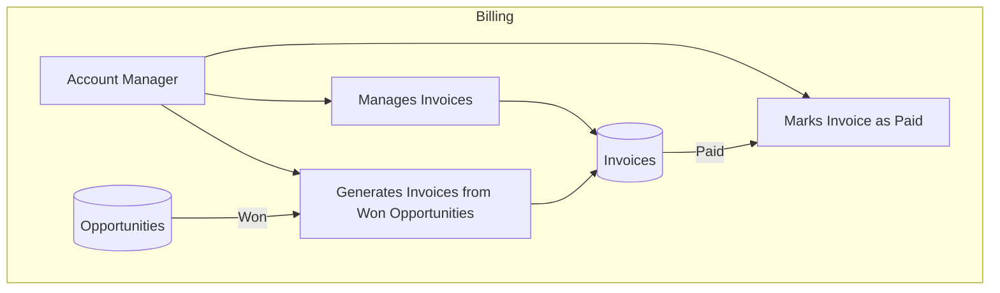
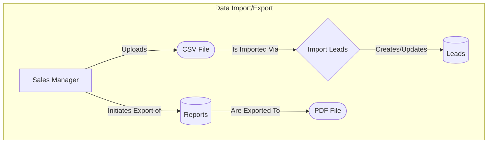

## CRM Data Flow Explanation

This data flow diagram illustrates the interactions between different user roles
(actors) and the core data entities within the Cus **Cases** and logging
**Interactions**.

This interconnected flow ensures that customer information is shared seamlessly
across departments, from initial contact to billing and support, creating a
unified view of the customer journey. lationship Management (CRM) domain. The
flow is organized by functional areas, such as Marketing, Sales, Customer
Support, and Billing, showing how each actor contributes to the overall
lifecycle of customer data.

### Marketing Flow

- **Marketing Manager**: This role focuses on lead generation. They create and
  manage marketing **Campaigns**. The performance of these campaigns is tracked
  by monitoring the **Leads** and **Opportunities** they generate, providing
  insight into marketing ROI.

### Sales Flow

The sales process is divided among several roles:

- **Sales Development Representative (SDR)**: The SDR is at the top of the sales
  funnel. They are responsible for creating new **Leads**. Their primary task is
  to qualify these leads. Once a lead is deemed qualified, the SDR converts it,
  which automatically creates corresponding **Companies**, **Contacts**, and
  **Opportunities** records.
- **Sales Representative (SR)**: The SR manages the ongoing relationships. They
  work with the **Companies** and **Contacts** created from converted leads. A
  key activity for the SR is logging all customer communications
  (**Interactions**). They also receive **Notifications** when new leads are
  assigned to them, enabling prompt follow-up.
- **Sales Manager**: This role has a high-level view of the sales pipeline. They
  monitor the status of **Opportunities** through a dashboard, manage the
  **Products** or services being sold, and generate **Reports** to track team
  performance.

### Customer Support Flow

- **Customer Support Agent (CSA)**: This user handles post-sales customer
  issues. They create and manage support **Cases**. When interacting with a
  customer regarding a case, they also log these **Interactions**, providing a
  complete history of customer communication that is visible across the sales
  and support teams.

### Billing Flow

- **Account Manager**: This role handles the financial aspects of a closed deal.
  When a sales opportunity is marked as "Won," the Account Manager generates an
  **Invoice** from it. They manage the invoice lifecycle, and once payment is
  received, they mark the invoice as "Paid."

### Data Management / I/O Flow

This flow illustrates how data is imported into and exported from the CRM
system.

- **Data Import**: A **Sales Manager** can perform a bulk import of **Leads** by
  uploading a CSV file. The system processes the file, maps the columns to the
  appropriate fields, and creates new lead records.
- **Data Export**: When viewing a **Report**, a **Sales Manager** has the option
  to export it as a PDF file for offline viewing, printing, or sharing.

### Data and Interactions Summary

The diagram shows a clear progression of data:

1. **Marketing** generates **Leads**.
2. **Sales (SDR)** qualifies and converts **Leads** into **Contacts**,
   **Companies**, and **Opportunities**.
3. **Sales (SR)** nurtures these relationships by logging **Interactions** and
   moving **Opportunities** through the pipeline.
4. **Sales (Manager)** oversees the process, manages the product catalog, and
   analyzes performance. They can also bulk-import **Leads** from CSV files and
   export **Reports** to PDF.
5. **Billing** takes over when an **Opportunity** is won to handle invoicing.
6. **Customer Support** manages any issues that arise, creating **Cases** and
   logging **Interactions**.
7. **Administration** underpins the entire system by managing user roles and
   permissions.

This interconnected flow ensures that customer information is shared seamlessly
across departments, from initial contact to billing and support, creating a
unified view of the customer journey.
