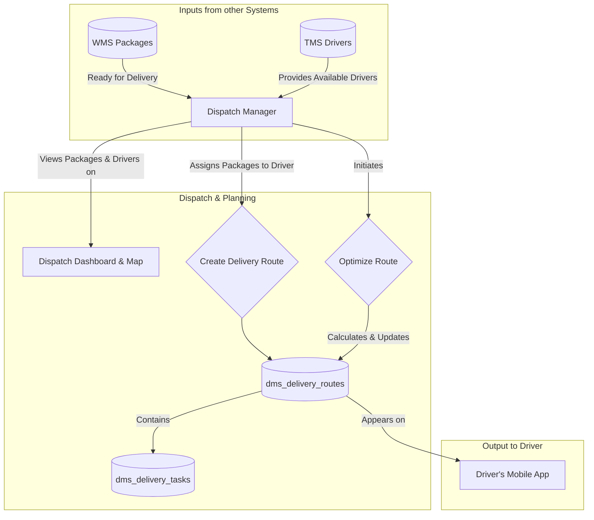
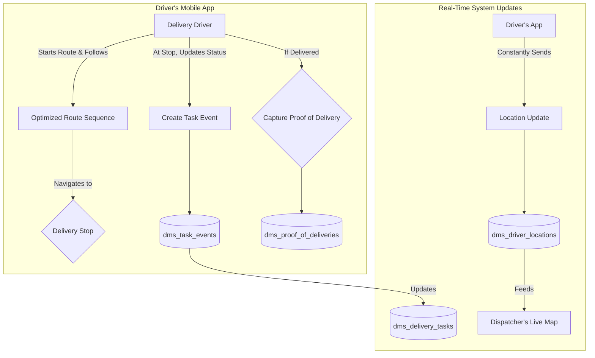
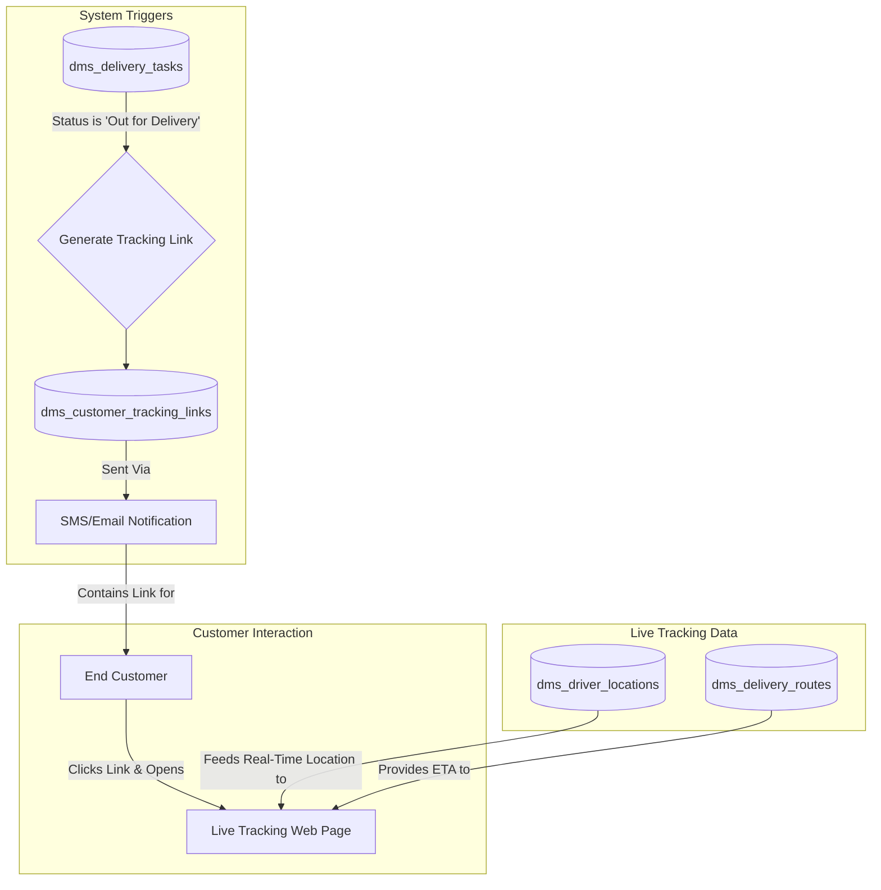

## DMS Data Flow Explanation

This document outlines the data flows within the Delivery Management System
(DMS), which focuses on the final mile of the delivery process. It covers how
delivery routes are planned, executed by drivers, and tracked by both
dispatchers and end customers.

### Dispatch & Route Optimization Flow

This flow describes how packages ready for shipment are assigned to drivers and
how their daily routes are planned and optimized.

- **Inputs**: The process begins when the **Dispatch Manager** receives a list
  of packaged orders from the WMS and a list of available drivers from the TMS.
- **Dispatch & Planning**:
  - Using a dashboard, the Dispatcher visualizes the package destinations and
    driver locations.
  - They assign one or more packages to a driver, which creates a **Delivery
    Route**. This route is composed of individual **Delivery Tasks**.
  - The Dispatcher then uses the system's **Route Optimizer** to calculate the
    most efficient sequence of stops. The optimized path and turn-by-turn data
    are saved to the route.
- **Output**: The newly created and optimized route appears on the assigned
  **Driver's** mobile application, ready for them to start their day.

### Driver Delivery Execution Flow

This flow details the driver's interaction with the mobile app to complete their
assigned deliveries.

- **Route Execution**: The **Delivery Driver** follows the optimized sequence of
  stops presented in their mobile app.
- **Task Updates**: At each stop, the driver updates the delivery status (e.g.,
  "Delivered," "Failed"). Each update creates a **Task Event**, providing a
  real-time audit trail.
- **Proof of Delivery**: For successful deliveries, the driver is prompted to
  capture **Proof of Delivery** (a signature or photo), which is linked to the
  specific delivery task.
- **Location Tracking**: Throughout the day, the driver's app sends GPS data to
  the system, which populates their **Driver Location** and allows the Dispatch
  Manager to monitor progress on a live map.

### Customer Tracking Experience Flow

This flow describes how the end customer is kept informed and can track their
package in real-time on the day of delivery.

- **Notification Trigger**: When a driver begins their route and a package is
  marked as "Out for Delivery," the system automatically generates a unique,
  secure **Customer Tracking Link**. This link is sent to the **End Customer**
  via SMS or email.
- **Live Tracking**: The customer clicks the link to open a web page displaying
  a live map. This page shows the real-time location of the delivery vehicle
  (fed by **Driver Locations**) and a dynamically updated Estimated Time of
  Arrival (ETA), giving the customer full visibility into the final stage of
  their delivery.
