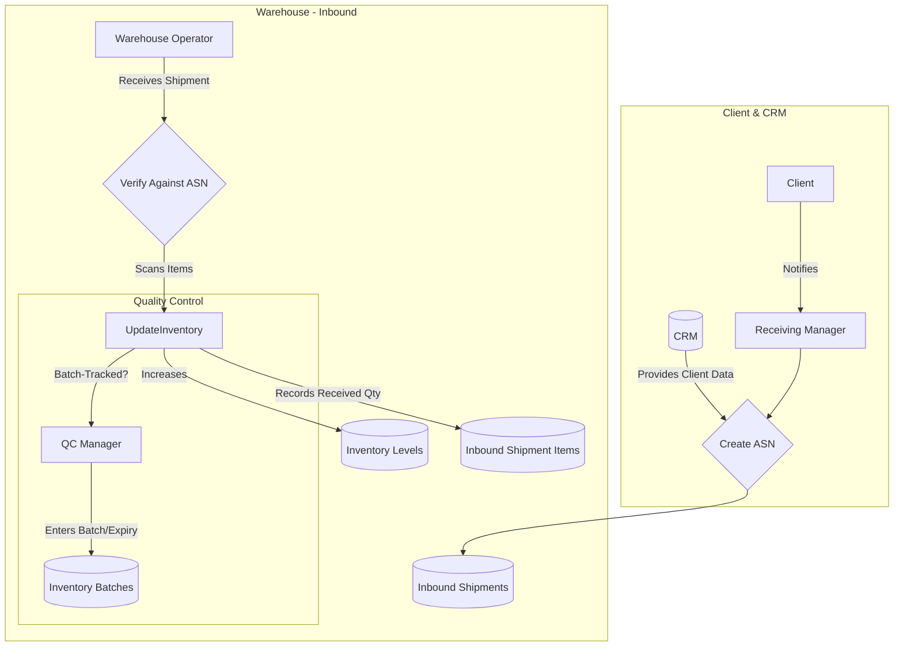
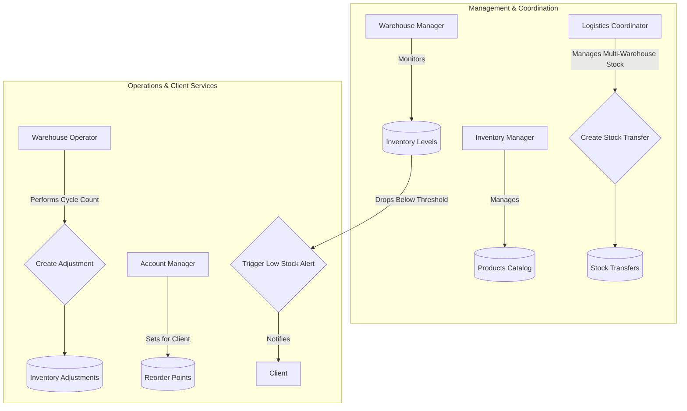
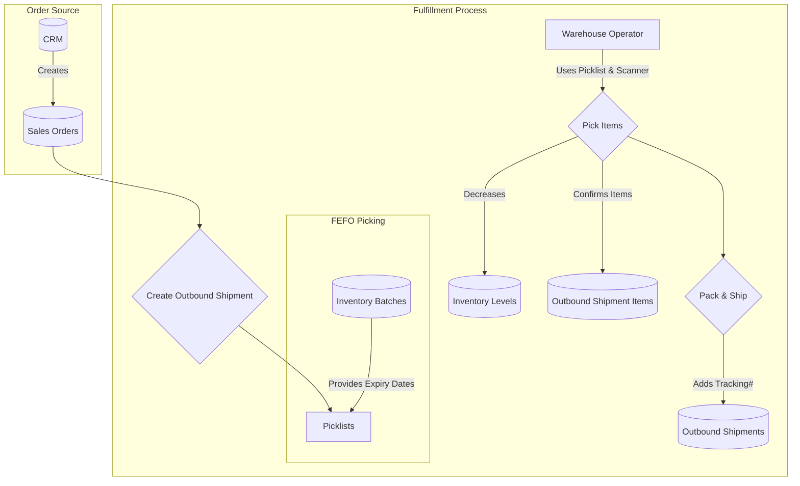
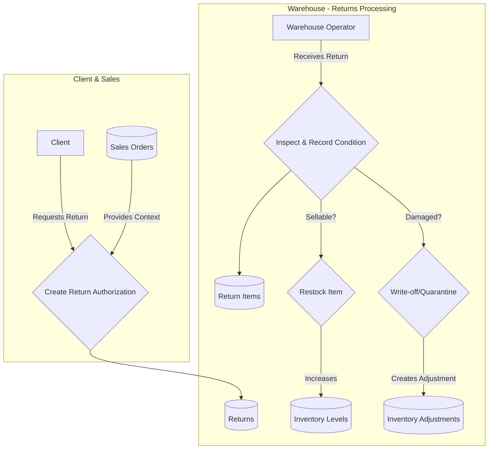

## IMS Data Flow Explanation

This document outlines the data flow within the Inventory Management System
(IMS), detailing how various user roles interact with the system to manage the
entire inventory lifecycle, from receiving goods to shipping orders.

### Inbound & Receiving Flow

This flow describes how new inventory enters the warehouse.

- **Client/CRM**: A **Client** informs the company of an incoming shipment. The
  **Receiving Manager** uses client data from the **CRM** to create an Advance
  Shipping Notice (ASN).
- **Receiving Manager**: Creates the ASN (**Inbound Shipment**) in the system,
  detailing the expected products and quantities.
- **Warehouse Operator**: When the physical shipment arrives, the operator
  verifies the contents against the ASN, often using a barcode scanner. This
  process updates the **Received Quantity** on the ASN's line items and
  increases the **Quantity on Hand** in the main **Inventory Levels**.
- **Quality Control Manager**: If a product is tracked by batch or requires an
  expiration date, the QC Manager ensures this information is captured and
  recorded in **Inventory Batches**.

### Inventory Control & Management Flow

This flow covers the internal management, monitoring, and movement of inventory.

- **Inventory/Warehouse Managers**: The **Inventory Manager** is responsible for
  maintaining the master **Product Catalog**. The **Warehouse Manager**
  continuously monitors real-time **Inventory Levels** to ensure visibility
  across all locations.
- **Logistics Coordinator**: To balance stock across facilities, the coordinator
  initiates **Stock Transfers** between warehouses.
- **Warehouse Operator**: To maintain accuracy, the operator performs cycle
  counts. Any discrepancies result in an **Inventory Adjustment** record,
  detailing the reason for the change.
- **Account Manager**: For specific clients, the Account Manager sets **Reorder
  Points**. When stock drops below this threshold, the system automatically
  sends a low-stock alert to the **Client**.

### Outbound & Fulfillment Flow

This flow details how customer orders are processed and shipped.

- **Order Creation**: **Sales Orders** are typically created in the **CRM** and
  synchronized with the IMS.
- **Fulfillment**: An **Outbound Shipment** record and a corresponding
  **Picklist** are generated for each order. For products tracked by expiration
  date, the picklist prioritizes items based on a First-Expired, First-Out
  (FEFO) strategy, pulling data from **Inventory Batches**.
- **Warehouse Operator**: The operator uses the picklist and a scanner to
  accurately **Pick Items**. This action decrements the **Inventory Levels** and
  confirms the items being prepared for shipment in the **Outbound Shipment
  Items** record.
- **Shipping**: Once packed, the shipment is dispatched. The **Outbound
  Shipment** record is updated with a carrier tracking number.

### Reverse Logistics / Returns Flow

This flow handles products that are sent back by clients, a process known as
reverse logistics.

- **Return Initiation**: A **Client** requests to return items from a previous
  **Sales Order**. This triggers the creation of a **Return** authorization
  record.
- **Receiving & Inspection**: A **Warehouse Operator** receives the physical
  items. They inspect each item and record its condition (e.g., `sellable`,
  `damaged`) in the **Return Items** record.
- **Disposition**:
  - If an item is in `sellable` condition, it is restocked, and the **Inventory
    Levels** are increased.
  - If an item is `damaged`, it is quarantined or written off, often creating an
    **Inventory Adjustment** to correctly update the records.

### Data and Interactions Summary

1. **Inbound**: Inventory is received against an ASN, and stock levels are
   increased.
2. **Management**: Stock is monitored, counted, adjusted, and transferred
   between locations to ensure accuracy and optimal distribution.
3. **Outbound**: Sales orders from the CRM are fulfilled by picking, packing,
   and shipping items, which decrements stock levels.
4. **Returns**: Returned items are inspected and either restocked (increasing
   inventory) or written off.
5. **Integration**: The entire process relies on tight integration with the CRM
   for client and order data, ensuring a single source of truth.
