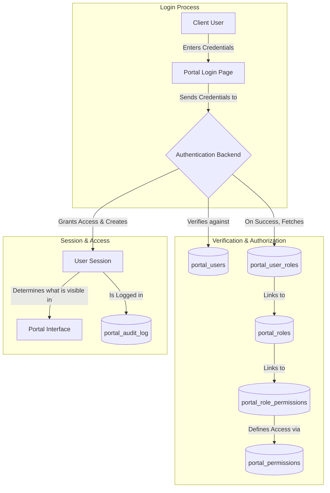
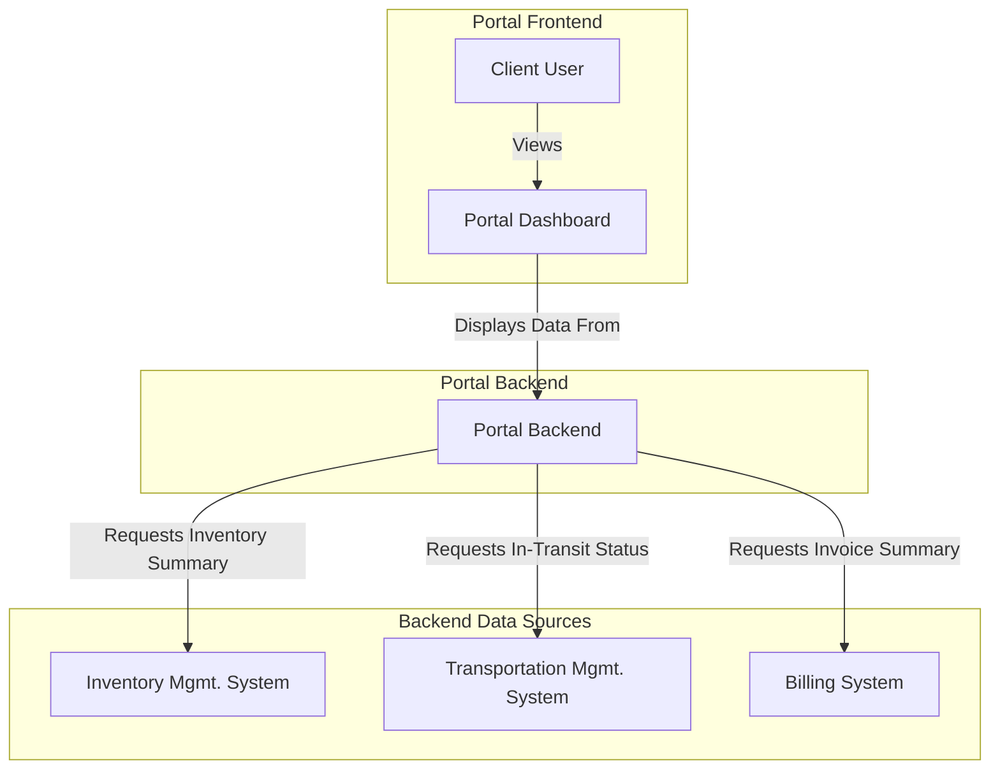
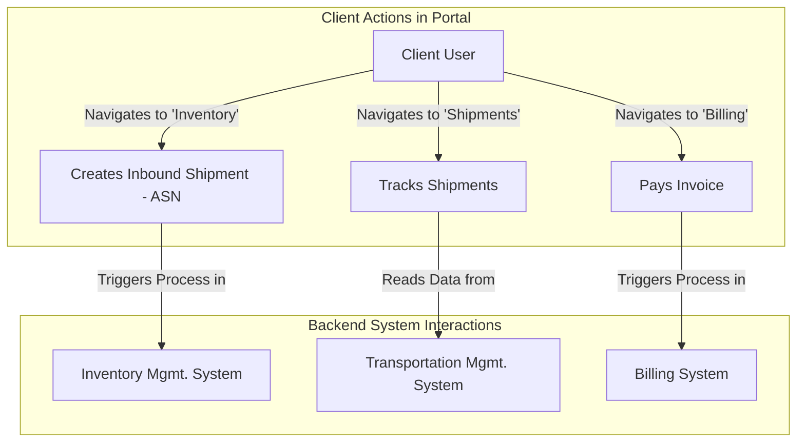
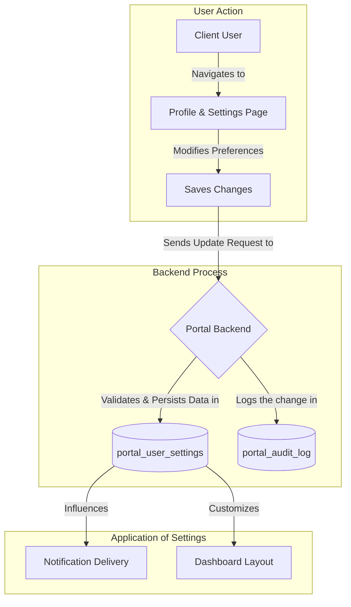
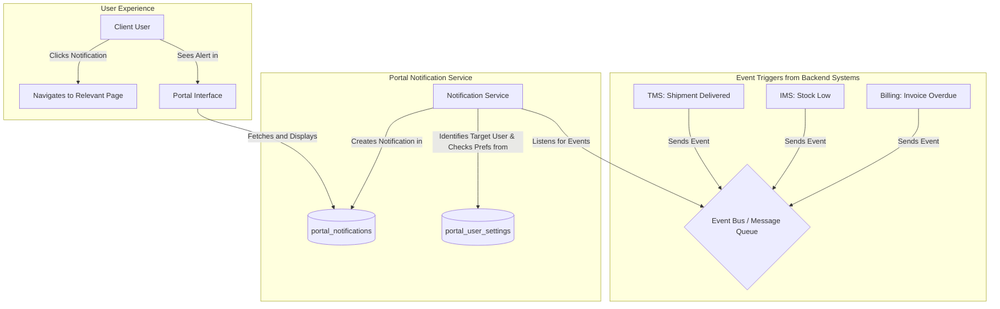
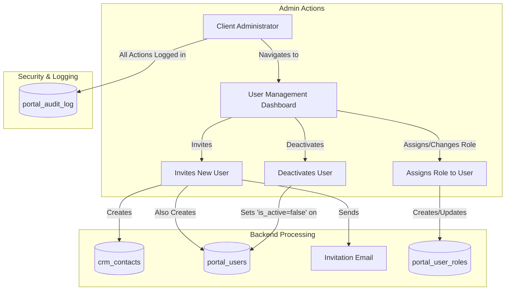

## Portal Data Flow Explanation

This document outlines the data flows for the client-facing Self-Service Portal.
The portal acts as a unified interface, aggregating data from various backend
systems and allowing clients to manage their logistics operations and account
information.

### User Authentication & Authorization Flow

This flow describes how a client user securely logs into the portal and how the
system determines what they are allowed to see and do.

- **Login**: A **Client User** enters their credentials. The system verifies
  their identity against the `portal_users` table.
- **Authorization**: Upon successful login, the system checks the user's
  assigned **Roles** and the **Permissions** associated with those roles. This
  determines their access rights (e.g., view invoices, create shipments).
- **Session**: A secure session is created, and all actions taken by the user
  during this session are recorded in the **Audit Log** for security and
  compliance. The user interface is tailored to show only the features they have
  permission to access.

### Dashboard Data Aggregation Flow

This flow illustrates how the main portal dashboard acts as a central hub,
pulling in and displaying summary data from multiple, distinct backend domains.

- **Data Aggregation**: When the **Client User** logs in and views their
  dashboard, the **Portal Backend** makes real-time requests to the other
  microservices.
- **Data Sources**:
  - It fetches current inventory levels from the **Inventory Management System
    (IMS)**.
  - It gets the status of in-transit shipments from the **Transportation
    Management System (TMS)**.
  - It retrieves a summary of outstanding invoices from the **Billing System**.
- **Presentation**: This aggregated data is then presented to the user in a
  unified **Dashboard**, providing a complete, high-level overview of their
  account at a glance.

### Self-Service Action Flows

This flow shows how a client uses the portal to perform actions that trigger
processes in the underlying logistics systems. The portal acts as a
user-friendly gateway to the specialized backend domains.

- **Inventory Management**: The client can navigate to an "Inventory" section to
  view detailed stock levels (reading data from the **IMS**) and can create a
  new Advance Shipping Notice (ASN), which initiates an inbound workflow within
  the **IMS**.
- **Shipment Tracking**: In the "Shipments" section, the client can view the
  real-time status and history of their shipments. This feature reads and
  displays data directly from the **TMS**.
- **Billing & Payments**: In the "Billing" section, the client can view their
  invoices and make payments. Clicking "Pay" initiates a payment workflow
  managed by the **Billing System**.

### User Settings & Profile Management Flow

This flow details how a user manages their personal settings and how those
preferences are stored and applied.

- **Modification**: The **Client User** accesses their **Profile & Settings
  Page** to change preferences, such as their notification settings or dashboard
  layout.
- **Persistence**: When changes are saved, the **Portal Backend** updates the
  `portal_user_settings` table for that specific user. The action is recorded in
  the `portal_audit_log`.
- **Application**: These saved settings are then used by the system to customize
  the user's experience, for example, by determining which **Notifications** to
  send or how to arrange the **Dashboard**.

### Notification Flow

This flow shows how events from other systems trigger notifications that are
delivered to the user within the portal.

- **Event Trigger**: An important business event occurs in a backend system
  (e.g., a shipment is delivered in the **TMS**). The system publishes an event
  to a central **Event Bus**.
- **Processing**: A dedicated **Notification Service** within the portal's
  backend listens for these events. It identifies the relevant user, checks
  their preferences in `portal_user_settings` to see if they want this type of
  alert, and then creates a new record in the `portal_notifications` table.
- **Delivery**: The new notification appears in the **Portal UI**. The user can
  click on it to be taken directly to the relevant page for more details (e.g.,
  the delivered shipment's tracking page).

### Client-Side User & Role Management Flow

This flow describes how a designated client administrator manages user accounts
and their permissions for their own organization within the portal.

- **Initiation**: A **Client Administrator**, who has special permissions,
  accesses the **User Management Dashboard**.
- **User Invitation**: The admin can invite a new user by providing their email.
  The backend creates a corresponding record in `crm_contacts` (if one doesn't
  exist) and a new, inactive `portal_users` record. An **Invitation Email** is
  sent to the new user to set up their account.
- **Role Assignment**: The admin can assign or change roles for users within
  their organization. This action creates or updates records in the
  `portal_user_roles` table, linking a user to a specific role (e.g., "Billing
  Viewer").
- **Deactivation**: If an employee leaves, the admin can deactivate their
  account, which sets the `is_active` flag to `false` in the `portal_users`
  table, immediately revoking their access.
- **Auditing**: All administrative actions are logged in the `portal_audit_log`
  to maintain a clear record of who made what changes and when.
