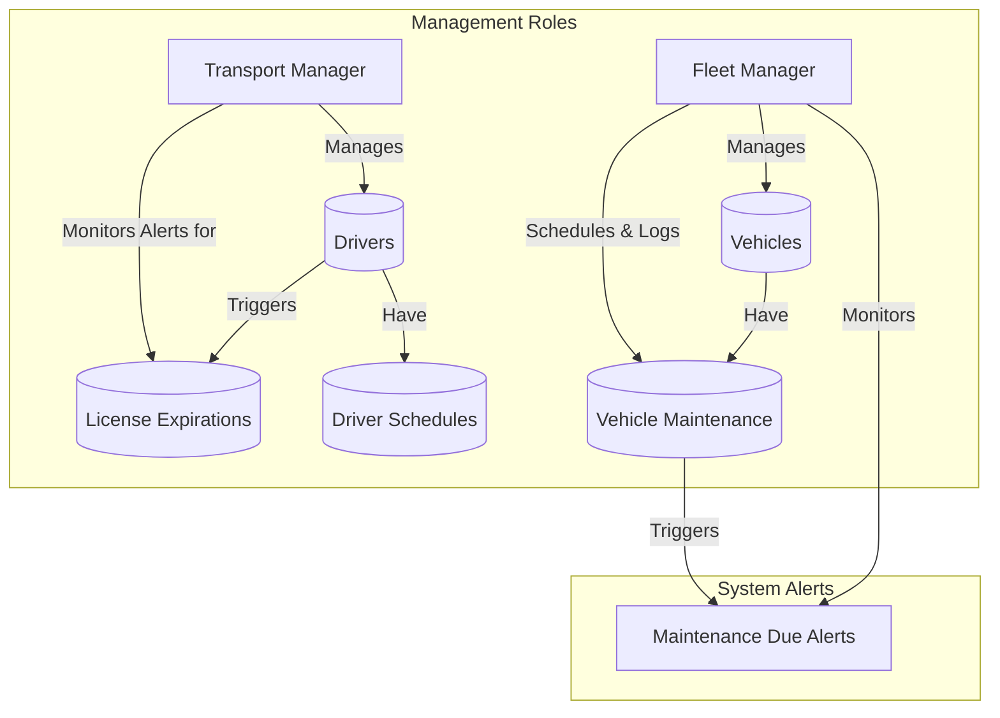
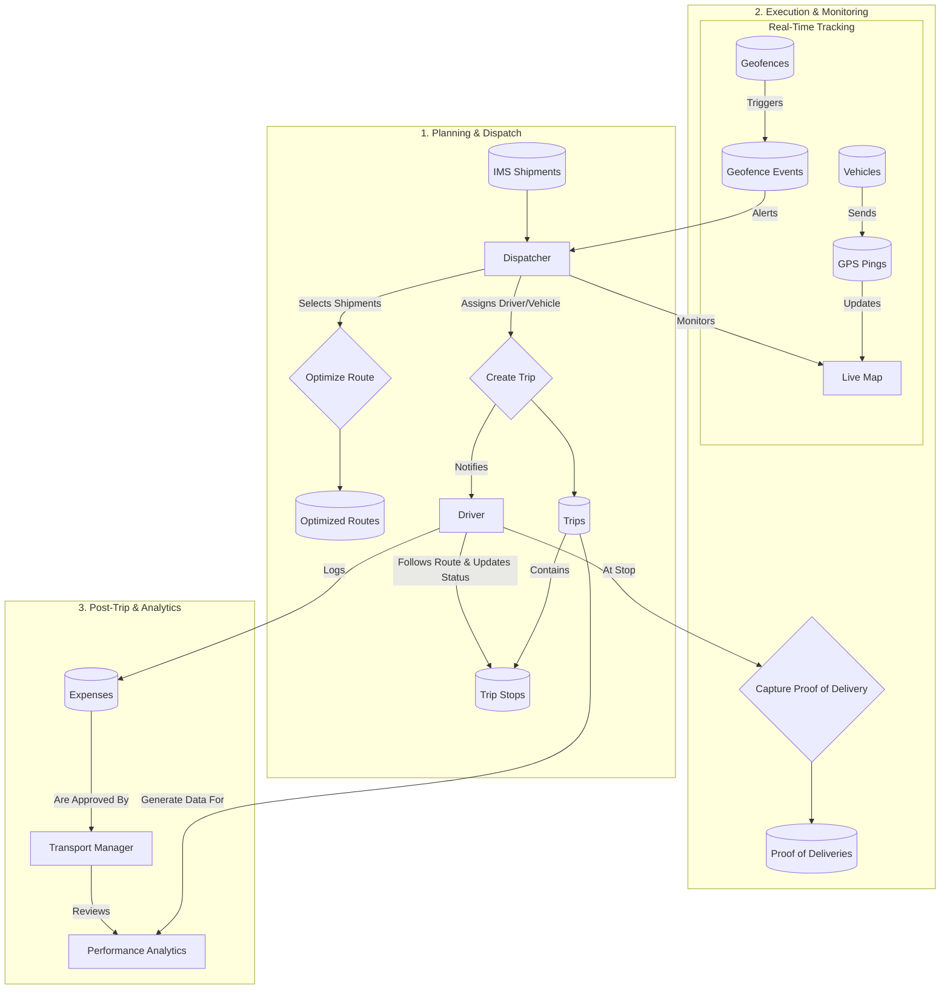
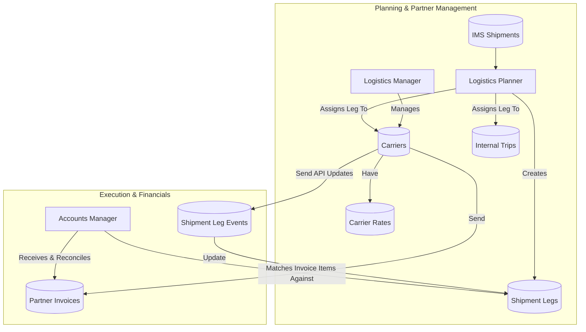

## TMS Data Flow Explanation

This document outlines the data flows within the Transportation Management
System (TMS), detailing how various roles manage the physical movement of goods.
The flows are broken down into managing internal resources, executing trips with
the internal fleet, and coordinating with third-party carriers.

### Fleet & Resource Management Flow

This flow describes how foundational resources like drivers and vehicles are
managed to ensure the fleet is ready for operations.

- **Transport Manager**: Manages driver profiles, including their contact
  information and license details. The system alerts them to upcoming license
  expirations. They also oversee driver schedules for availability.
- **Fleet Manager**: Manages the vehicle fleet, including adding new vehicles
  and updating their status (e.g., "Available," "In Maintenance"). They are
  responsible for logging all maintenance activities and receive system alerts
  for scheduled services.

### Internal Trip Lifecycle Flow

This flow details the end-to-end process for a shipment handled by the company's
own drivers and vehicles.

1. **Planning & Dispatch**:
   - A **Dispatcher** receives outbound shipments from the IMS.
   - They can use a **Route Optimizer** to create the most efficient multi-stop
     route.
   - The Dispatcher then creates a **Trip**, assigning an available **Driver**
     and **Vehicle**. The driver is notified via their mobile app.
2. **Execution & Monitoring**:
   - The **Driver** follows the route, updating the status of each **Trip Stop**
     as they complete it.
   - The vehicle's GPS sends real-time location data (**GPS Pings**) to a **Live
     Map** that the **Dispatcher** monitors.
   - **Geofence Events** (e.g., entering a customer's warehouse) trigger
     automated alerts for the Dispatcher.
   - Upon delivery, the Driver captures **Proof of Delivery** (signature or
     photo), which is stored against the trip stop.
3. **Post-Trip & Analytics**:
   - The **Driver** logs any trip-related **Expenses** (fuel, tolls) via their
     app.
   - The **Transport Manager** reviews and approves these expenses for
     reimbursement.
   - Data from completed trips feeds into **Performance Analytics** dashboards,
     which the Transport Manager uses to review driver efficiency and on-time
     rates.

### Third-Party & Multi-Leg Shipment Flow

This flow describes how complex shipments involving external partners are
managed.

- **Planning & Partner Management**:
  - A **Logistics Manager** maintains a directory of third-party **Carriers**
    and their rate cards.
  - For a complex shipment, a **Logistics Planner** breaks the journey down into
    multiple **Shipment Legs**.
  - Each leg is assigned to either the internal fleet (creating a Trip) or an
    external **Carrier**.
- **Execution & Financials**:
  - For legs handled by partners, the system ingests tracking updates via API,
    creating **Shipment Leg Events** to provide end-to-end visibility.
  - After completion, **Carriers** submit **Partner Invoices**.
  - An **Accounts Manager** reconciles these invoices, matching the line items
    against the costs recorded for each completed shipment leg and flagging
    discrepancies.
