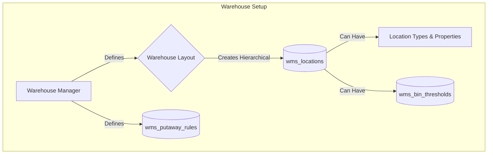
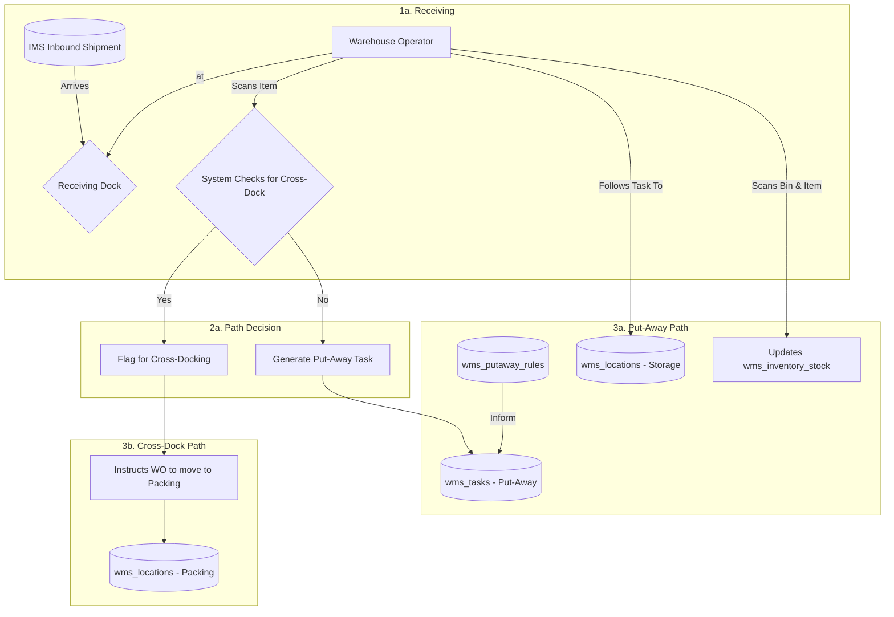
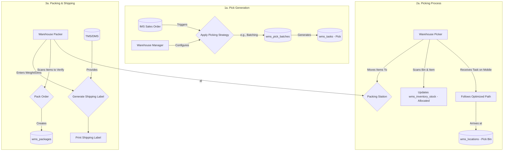
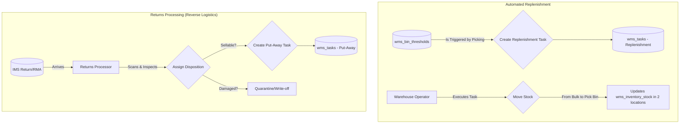
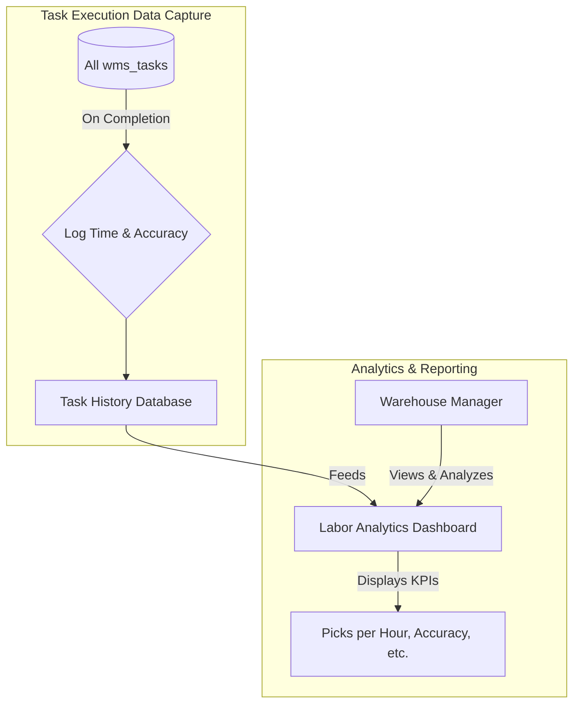

## WMS Data Flow Explanation

This document outlines the data flows within the Warehouse Management System
(WMS), which orchestrates the physical tasks inside a warehouse, from receiving
and storing inventory to picking, packing, and shipping orders.

### Warehouse Configuration & Setup Flow

This initial flow describes the foundational process of defining the warehouse's
digital twin, managed by a Warehouse Manager.

- **Warehouse Manager**: Configures the entire physical layout of the warehouse
  in the system. This includes creating a hierarchy of **Locations** (zones,
  aisles, racks, bins) and defining their properties (type, capacity). They also
  set up **Put-away Rules** to guide storage and **Bin Thresholds** to trigger
  automated replenishment.

### Inbound & Put-Away Flow

This flow details how incoming goods are processed, from the receiving dock to
their final storage location, including the cross-docking process.

1. **Receiving**: A **Warehouse Operator** at the receiving dock scans items
   from an **Inbound Shipment (ASN)**.
2. **Path Decision**: For each item scanned, the system checks if it's needed
   for a waiting outbound order.
3. **Put-Away Path**: If not needed immediately, the system uses **Put-away
   Rules** to generate a `Put-Away` **Task**, directing the operator to the
   optimal storage bin. The operator scans the item into the bin, updating its
   location and status in **Inventory Stock**.
4. **Cross-Dock Path**: If the item is needed for an order, it's flagged for
   cross-docking. The operator is instructed to move it directly to a **Packing
   Station**, bypassing storage.

### Outbound Fulfillment Flow (Pick, Pack, Ship)

This flow describes the process of fulfilling a customer order, from picking the
items to getting the package ready for the carrier.

1. **Pick Generation**: A **Sales Order** from the IMS initiates the process.
   The WMS applies the configured **Picking Strategy** (e.g., batching multiple
   orders) to create an efficient **Pick Task**.
2. **Picking**: A **Picker** receives the task on a mobile device, which guides
   them along an optimized path. They scan locations and items to ensure
   accuracy. The inventory status is updated to "Allocated."
3. **Packing & Shipping**: At the **Packing Station**, a **Packer** verifies the
   picked items by scanning them again. They pack the items into a **Package**,
   record its final weight and dimensions, and the system interfaces with the
   **TMS/DMS** to generate and print the correct shipping label.

### Internal Operations & Reverse Logistics Flow

This flow covers internal tasks that maintain warehouse efficiency, including
stock replenishment and processing returns.

- **Replenishment**: When a pick causes the quantity in a primary pick bin to
  drop below its defined **Threshold**, the system automatically generates a
  `Replenishment` **Task**. A **Warehouse Operator** is then directed to move
  stock from a bulk storage location to the pick bin to ensure it remains
  stocked.
- **Returns Processing**: When a customer **Return** arrives, a **Returns
  Processor** inspects the items. Based on the assigned disposition, the item is
  either put back into inventory via a new `Put-Away` **Task** (if "Resellable")
  or moved to a quarantine area for write-off.

### Performance & Labor Management Flow

This flow shows how operational data is captured and used for analytics.

- **Data Capture**: As operators complete any **WMS Task** (picking, put-away,
  etc.), the system logs key data points like the time taken and the accuracy of
  the operation.
- **Analytics**: This historical data feeds into a **Labor Analytics
  Dashboard**. A **Warehouse Manager** can view KPIs like picks per hour and
  order cycle time to monitor productivity, identify bottlenecks, and manage
  team performance.
