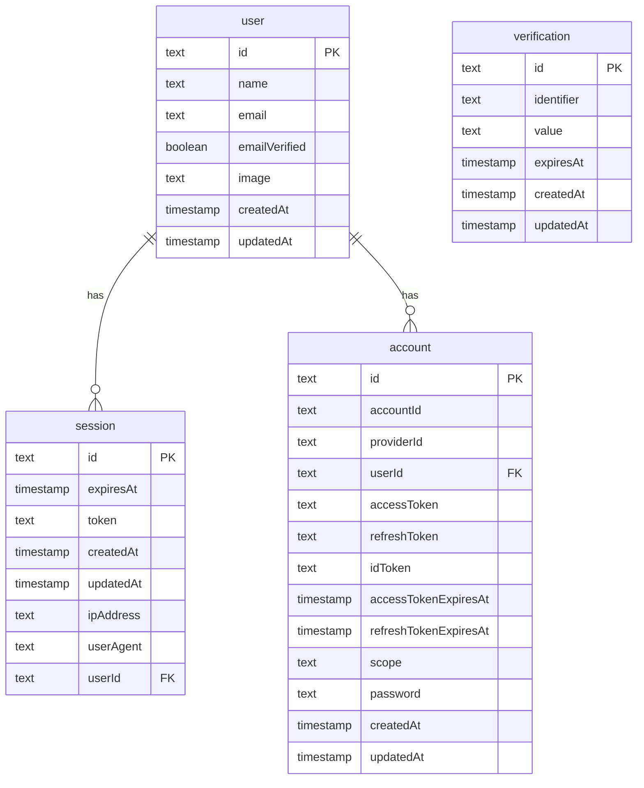

## Auth Domain Explanation

The Auth domain handles user authentication, session management, and account
security. It is based on the `better-auth` system.

### user

Represents a user in the system.

- `id`: Unique identifier for the user.
- `name`: The user's full name.
- `email`: The user's email address, used for login and communication.
- `emailVerified`: A boolean flag to indicate if the user has verified their
  email address.
- `image`: A URL to the user's profile picture.

### session

Stores session information for logged-in users.

- `id`: Unique identifier for the session.
- `expiresAt`: The timestamp when the session expires.
- `token`: The unique token for the session.
- `ipAddress`: The IP address from which the session was created.
- `userAgent`: The user agent of the client.
- `userId`: A foreign key referencing the `user` table.

### account

Links a user to different authentication providers (e.g., email/password,
Google, GitHub).

- `id`: Unique identifier for the account.
- `accountId`: The ID of the account from the provider.
- `providerId`: The ID of the authentication provider (e.g., "credentials",
  "google").
- `userId`: A foreign key referencing the `user` table.
- `accessToken`: The access token from the provider.
- `refreshToken`: The refresh token from the provider.
- `idToken`: The ID token from the provider.
- `accessTokenExpiresAt`: The expiration timestamp for the access token.
- `refreshTokenExpiresAt`: The expiration timestamp for the refresh token.
- `scope`: The scope of permissions granted by the provider.
- `password`: The hashed password for credentials-based authentication.

### verification

Stores tokens for email verification or password reset.

- `id`: Unique identifier for the verification record.
- `identifier`: The identifier for the verification (e.g., email address).
- `value`: The verification token.
- `expiresAt`: The timestamp when the verification token expires.
