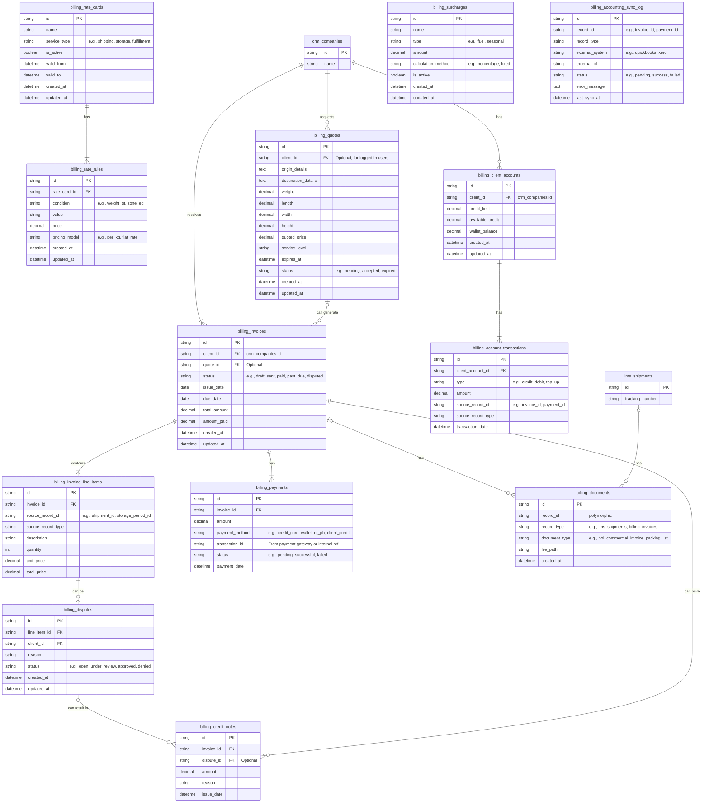

```mermaid
erDiagram
    %% Shared Entities (Defined in other diagrams)
    crm_companies {
        string id PK
        string name
    }
    lms_shipments {
        string id PK
        string tracking_number
    }

    %% BILLING

    billing_rate_cards {
        string id PK
        string name
        string service_type "e.g., shipping, storage, fulfillment"
        boolean is_active
        datetime valid_from
        datetime valid_to
        datetime created_at
        datetime updated_at
    }

    billing_rate_rules {
        string id PK
        string rate_card_id FK
        string condition "e.g., weight_gt, zone_eq"
        string value
        decimal price
        string pricing_model "e.g., per_kg, flat_rate"
        datetime created_at
        datetime updated_at
    }

    billing_surcharges {
        string id PK
        string name
        string type "e.g., fuel, seasonal"
        decimal amount
        string calculation_method "e.g., percentage, fixed"
        boolean is_active
        datetime created_at
        datetime updated_at
    }

    billing_quotes {
        string id PK
        string client_id FK "Optional, for logged-in users"
        text origin_details
        text destination_details
        decimal weight
        decimal length
        decimal width
        decimal height
        decimal quoted_price
        string service_level
        datetime expires_at
        string status "e.g., pending, accepted, expired"
        datetime created_at
        datetime updated_at
    }

    billing_client_accounts {
        string id PK
        string client_id FK "crm_companies.id"
        decimal credit_limit
        decimal available_credit
        decimal wallet_balance
        datetime created_at
        datetime updated_at
    }

    billing_account_transactions {
        string id PK
        string client_account_id FK
        string type "e.g., credit, debit, top_up"
        decimal amount
        string source_record_id "e.g., invoice_id, payment_id"
        string source_record_type
        datetime transaction_date
    }

    billing_invoices {
        string id PK
        string client_id FK "crm_companies.id"
        string quote_id FK "Optional"
        string status "e.g., draft, sent, paid, past_due, disputed"
        date issue_date
        date due_date
        decimal total_amount
        decimal amount_paid
        datetime created_at
        datetime updated_at
    }

    billing_invoice_line_items {
        string id PK
        string invoice_id FK
        string source_record_id "e.g., shipment_id, storage_period_id"
        string source_record_type
        string description
        int quantity
        decimal unit_price
        decimal total_price
    }

    billing_payments {
        string id PK
        string invoice_id FK
        decimal amount
        string payment_method "e.g., credit_card, wallet, qr_ph, client_credit"
        string transaction_id "From payment gateway or internal ref"
        string status "e.g., pending, successful, failed"
        datetime payment_date
    }

    billing_disputes {
        string id PK
        string line_item_id FK
        string client_id FK
        string reason
        string status "e.g., open, under_review, approved, denied"
        datetime created_at
        datetime updated_at
    }

    billing_credit_notes {
        string id PK
        string invoice_id FK
        string dispute_id FK "Optional"
        decimal amount
        string reason
        datetime issue_date
    }

    billing_documents {
        string id PK
        string record_id "polymorphic"
        string record_type "e.g., lms_shipments, billing_invoices"
        string document_type "e.g., bol, commercial_invoice, packing_list"
        string file_path
        datetime created_at
    }

    billing_accounting_sync_log {
        string id PK
        string record_id "e.g., invoice_id, payment_id"
        string record_type
        string external_system "e.g., quickbooks, xero"
        string external_id
        string status "e.g., pending, success, failed"
        text error_message
        datetime last_sync_at
    }

    %% Relationships
    billing_rate_cards              ||--|{ billing_rate_rules : "has"
    crm_companies                   ||--o{ billing_quotes : "requests"
    billing_quotes                  |o--o{ billing_invoices : "can generate"
    crm_companies                   ||--o{ billing_client_accounts : "has"
    billing_client_accounts         ||--|{ billing_account_transactions : "has"
    crm_companies                   ||--|{ billing_invoices : "receives"
    billing_invoices                ||--|{ billing_invoice_line_items : "contains"
    billing_invoices                ||--|{ billing_payments : "has"
    billing_invoices                ||--o{ billing_credit_notes : "can have"
    billing_invoice_line_items      ||--o{ billing_disputes : "can be"
    billing_disputes                |o--o{ billing_credit_notes : "can result in"
    lms_shipments                   |o--o{ billing_documents : "has"
    billing_invoices                |o--o{ billing_documents : "has"
```
