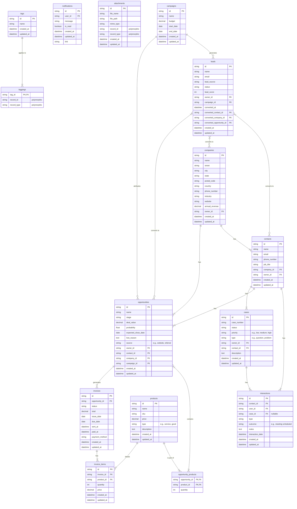

## CRM Domain Explanation

The CRM domain is dedicated to managing customer relationships, tracking
interactions, and enabling sales and marketing activities within the broader
logistics-management-system. This domain focuses on consolidating customer data,
managing communications, and streamlining the sales pipeline to enhance customer
engagement and drive business growth. It integrates seamlessly with other
modules of the logistics management system, ensuring that customer-related
processes such as invoicing, lead conversion, and support case management are
aligned with overall operational logistics.

Actors involved in this system include sales managers, marketing managers,
customer support agents, account managers, and sales development
representatives. These roles interact with the CRM to perform tasks such as
tracking sales opportunities, managing campaigns, logging interactions, and
generating invoices. The attached user stories in `docs/stories/crm.md` provide
detailed scenarios that highlight these interactions and demonstrate the value
the CRM brings to the logistics management system by improving customer
experience and operational efficiency.

Below is a detailed explanation of each entity and its key fields (excluding the
redundant fields `id`, `created_at`, and `updated_at`).

### Companies

Stores information about customer organizations. This is a central entity for
linking contacts, opportunities, and cases.

- `name`: Company name.
- `street`: Street address.
- `city`: City location.
- `state`: State or province.
- `postal_code`: Postal or ZIP code.
- `country`: Country of operation.
- `phone_number`: Company contact number.
- `industry`: Sector or industry type.
- `website`: Company website URL.
- `annual_revenue`: Yearly revenue figure.
- `owner_id`: Reference to the user who owns the company record.

### Contacts

Represents individuals associated with companies, serving as the primary points
of interaction.

- `name`: Full name of the contact.
- `email`: Contact’s email address.
- `phone_number`: Contact's telephone number.
- `job_title`: Job designation or position.
- `company_id`: Identifier linking to the associated company.
- `owner_id`: Reference to the user responsible for the contact.

### Interactions

Logs all communications and activities with contacts, providing a complete
history of customer engagement.

- `contact_id`: Linked contact for the interaction.
- `user_id`: User who performed the interaction.
- `case_id`: Associated case (if applicable).
- `type`: Type of interaction (e.g., call, meeting, email).
- `outcome`: Result of the interaction (e.g., meeting scheduled).
- `notes`: Additional details or comments.
- `interaction_date`: Date and time of the interaction.

### Campaigns

Tracks marketing initiatives to measure their effectiveness in generating leads
and opportunities.

- `name`: Campaign title.
- `budget`: Allocated budget for the campaign.
- `start_date`: Campaign start date.
- `end_date`: Campaign end date.

### Leads

Captures potential customers who have shown interest but are not yet qualified.

- `name`: Lead’s full name.
- `email`: Lead’s email address.
- `lead_source`: Origin of the lead information.
- `status`: Current qualification status.
- `lead_score`: Numerical score reflecting lead quality.
- `owner_id`: User responsible for the lead.
- `campaign_id`: Associated marketing campaign.
- `converted_at`: Timestamp when the lead was converted.
- `converted_contact_id`: Reference to the created contact upon conversion.
- `converted_company_id`: Reference to the company record created upon
  conversion.
- `converted_opportunity_id`: Reference to the opportunity created upon
  conversion.

### Opportunities

Represents potential sales deals, tracked through various stages of the sales
pipeline.

- `name`: Opportunity title.
- `stage`: Current stage in the sales pipeline.
- `deal_value`: Potential deal amount.
- `probability`: Likelihood of closing, represented as a fraction or percentage.
- `expected_close_date`: Anticipated date for closing the opportunity.
- `lost_reason`: Explanation for why the opportunity was lost.
- `source`: Origin of the opportunity (e.g., website, referral).
- `owner_id`: User responsible for the opportunity.
- `contact_id`: Associated contact.
- `company_id`: Linked company record.
- `campaign_id`: Related campaign.

### Products

Manages the catalog of goods or services that can be sold to customers.

- `name`: Name of the product or service.
- `sku`: Stock keeping unit identifier.
- `price`: Cost of the product.
- `type`: Type of offering (e.g., service, good).
- `description`: Description or details about the product.

### Opportunity Products

Links products from the catalog to specific sales opportunities, detailing what
is being sold.

- `opportunity_id`: Identifier linking to the related opportunity.
- `product_id`: Identifier linking to the product.
- `quantity`: Number of units associated with the opportunity.

### Cases

Tracks customer support issues or requests from creation to resolution.

- `case_number`: Unique number assigned to the case.
- `status`: Current case status.
- `priority`: Level of urgency (e.g., low, medium, high).
- `type`: Type of case (e.g., question, problem).
- `owner_id`: User responsible for handling the case.
- `contact_id`: Linked contact for context.
- `description`: Detailed description of the issue.

### Invoices

Generates and tracks billing records for products or services sold in an
opportunity.

- `opportunity_id`: Associated sales opportunity.
- `status`: Current status of the invoice (e.g., draft, sent, paid).
- `total`: Total amount billed.
- `issue_date`: Date on which the invoice was issued.
- `due_date`: Payment due date.
- `sent_at`: Timestamp when the invoice was sent.
- `paid_at`: Timestamp when payment was received.
- `payment_method`: Method used for payment.

### Invoice Items

Details the line items on an invoice, including products, quantities, and
prices.

- `invoice_id`: Linked invoice record.
- `product_id`: Associated product for the line item.
- `quantity`: Quantity of the product.
- `price`: Price per unit for the product.

### Notifications

Provides an in-app system for alerting users about important events, such as new
lead assignments.

- `user_id`: User receiving the notification.
- `message`: Notification content.
- `is_read`: Boolean indicating if the notification has been read.
- `link`: URL or path for further action/reference.

### Attachments

Allows files to be attached to various records (e.g., contacts, opportunities,
cases) for additional context.

- `file_name`: Name of the attached file.
- `file_path`: Storage path for the file.
- `mime_type`: File MIME type (e.g., image/png, application/pdf).
- `record_id`: Identifier for the record the attachment is associated with.
- `record_type`: Type of record (polymorphic).

### Tags

Enables flexible categorization of records using custom labels.

- `name`: Label or tag name.

### Taggings

Associates tags with specific records, allowing for advanced filtering and
organization.

- `tag_id`: Linked tag identifier.
- `record_id`: Identifier of the tagged record.
- `record_type`: Type of record associated with the tag.
