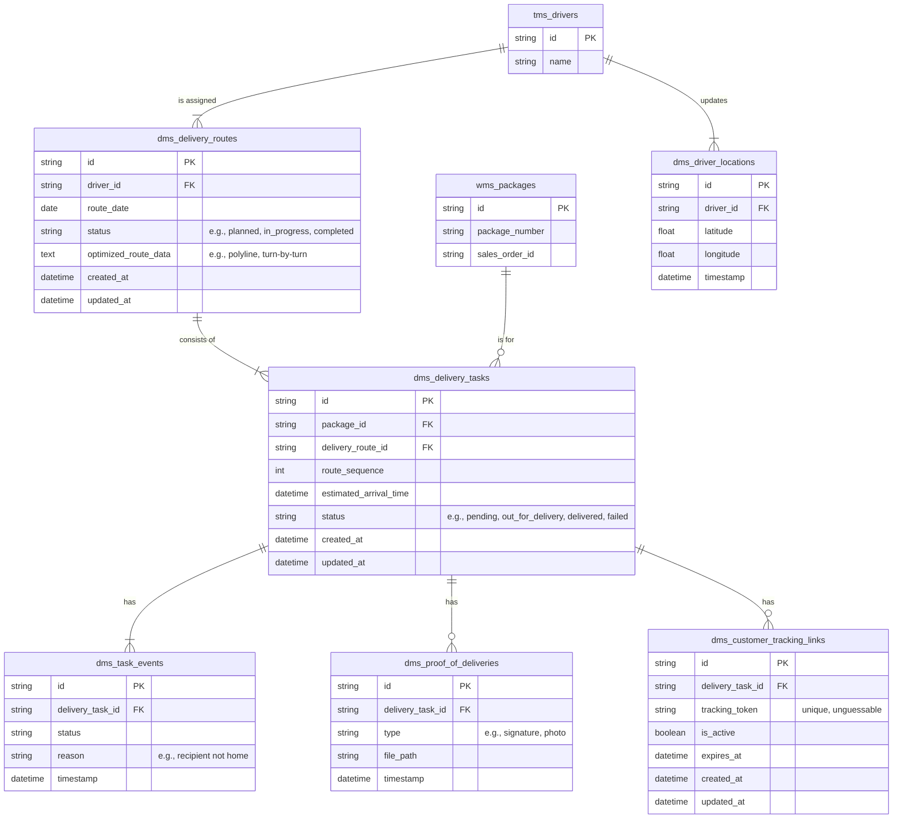

## DMS Domain Explanation

The Delivery Management System (DMS) is a critical component of the overall
logistics platform, designed to streamline and optimize the final stage of the
delivery process. It provides functionalities for route planning, real-time
tracking, and proof of delivery, ensuring efficient and transparent operations
from the warehouse to the customer's doorstep. The system integrates with the
Transportation Management System ([TMS](./tms.md)) and Warehouse Management
System ([WMS](./wms.md)) to create a seamless end-to-end logistics workflow.

Actors involved in this system include delivery drivers, dispatch managers,
route planners, customer service representatives, and logistics coordinators.
These roles interact with the DMS to perform tasks such as planning optimal
delivery routes, tracking driver locations in real-time, managing delivery
tasks, and providing customers with delivery updates and proof of delivery.

Below is a detailed explanation of each entity and its key fields (excluding the
redundant fields `id`, `created_at`, and `updated_at`).

### DMS Delivery Routes

Represents planned routes for drivers, optimized for efficiency and containing
multiple delivery tasks.

- `driver_id`: Reference to the assigned driver from the TMS.
- `route_date`: Scheduled date for the delivery route.
- `status`: Current state of the route (e.g., planned, in_progress, completed).
- `optimized_route_data`: Stored route optimization data such as polylines and
  turn-by-turn directions.

### DMS Delivery Tasks

Individual delivery tasks within a route, each corresponding to a specific
package that needs to be delivered.

- `package_id`: Reference to the package from the WMS.
- `delivery_route_id`: Reference to the delivery route this task belongs to.
- `route_sequence`: Order of this delivery within the route.
- `estimated_arrival_time`: Calculated time when the delivery is expected.
- `status`: Current status of the delivery task (e.g., pending,
  out_for_delivery, delivered, failed).

### DMS Task Events

Tracks status changes and events for delivery tasks, providing a detailed audit
trail of the delivery process.

- `delivery_task_id`: Reference to the associated delivery task.
- `status`: The new status being recorded.
- `reason`: Additional context for the status change (e.g., "recipient not
  home").
- `timestamp`: When the event occurred.

### DMS Proof of Deliveries

Stores evidence of successful deliveries, such as signatures or photos, ensuring
accountability and customer satisfaction.

- `delivery_task_id`: Reference to the completed delivery task.
- `type`: Type of proof collected (e.g., signature, photo).
- `file_path`: Storage location of the proof file.
- `timestamp`: When the proof was collected.

### DMS Driver Locations

Real-time location tracking for drivers, enabling accurate ETAs and route
monitoring.

- `driver_id`: Reference to the driver from the TMS.
- `latitude`: Geographic latitude coordinate.
- `longitude`: Geographic longitude coordinate.
- `timestamp`: When the location was recorded.

### DMS Customer Tracking Links

Provides customers with secure, unique links to track their deliveries in
real-time.

- `delivery_task_id`: Reference to the delivery task being tracked.
- `tracking_token`: Unique, unguessable identifier for secure access.
- `is_active`: Whether the tracking link is currently valid.
- `expires_at`: When the tracking link will expire.
