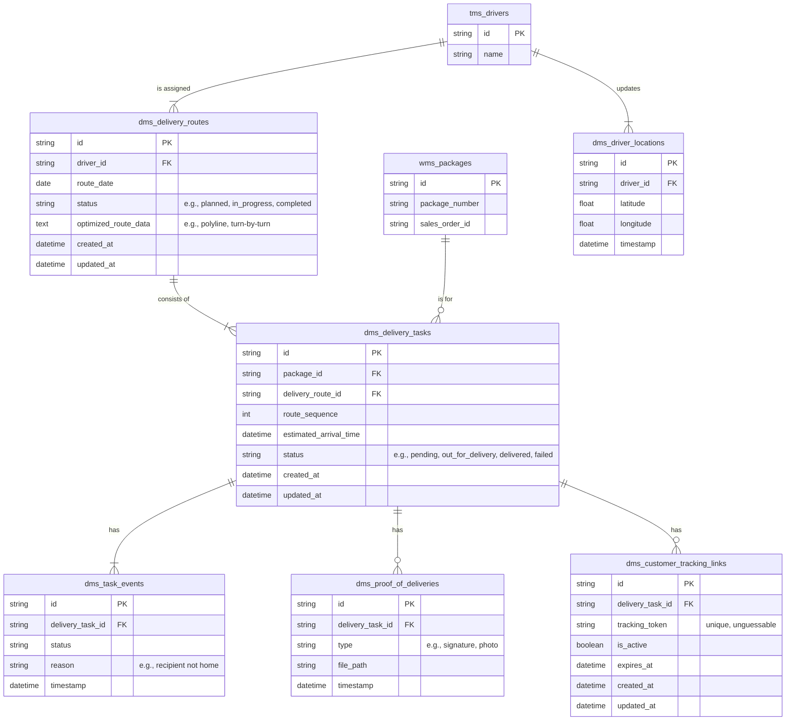

```mermaid
erDiagram
    %% Shared Entities (Defined in other diagrams)
    tms_drivers {
        string id PK
        string name
    }
    wms_packages {
        string id PK
        string package_number
        string sales_order_id
    }

    %% DMS (Delivery Management System)

    dms_delivery_routes {
        string id PK
        string driver_id FK
        date route_date
        string status "e.g., planned, in_progress, completed"
        text optimized_route_data "e.g., polyline, turn-by-turn"
        datetime created_at
        datetime updated_at
    }

    dms_delivery_tasks {
        string id PK
        string package_id FK
        string delivery_route_id FK
        int route_sequence
        datetime estimated_arrival_time
        string status "e.g., pending, out_for_delivery, delivered, failed"
        datetime created_at
        datetime updated_at
    }

    dms_task_events {
        string id PK
        string delivery_task_id FK
        string status
        string reason "e.g., recipient not home"
        datetime timestamp
    }

    dms_proof_of_deliveries {
        string id PK
        string delivery_task_id FK
        string type "e.g., signature, photo"
        string file_path
        datetime timestamp
    }

    dms_driver_locations {
        string id PK
        string driver_id FK
        float latitude
        float longitude
        datetime timestamp
    }

    dms_customer_tracking_links {
        string id PK
        string delivery_task_id FK
        string tracking_token "unique, unguessable"
        boolean is_active
        datetime expires_at
        datetime created_at
        datetime updated_at
    }

    %% DMS Relationships
    tms_drivers             ||--|{ dms_delivery_routes : "is assigned"
    dms_delivery_routes     ||--|{ dms_delivery_tasks : "consists of"
    wms_packages            ||--o{ dms_delivery_tasks : "is for"
    dms_delivery_tasks      ||--|{ dms_task_events : "has"
    dms_delivery_tasks      ||--o{ dms_proof_of_deliveries : "has"
    dms_delivery_tasks      ||--o{ dms_customer_tracking_links : "has"
    tms_drivers             ||--|{ dms_driver_locations : "updates"
```
