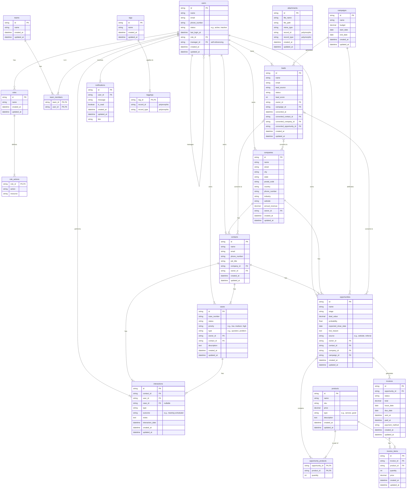

```mermaid
erDiagram
    users {
        string id PK
        string name
        string email
        string phone_number
        string status "e.g., active, inactive"
        datetime last_login_at
        string role_id FK
        string manager_id FK "self-referencing"
        datetime created_at
        datetime updated_at
    }

    roles {
        string id PK
        string name
        datetime created_at
        datetime updated_at
    }

    role_actions {
        string role_id PK, FK
        string action
        string resource
    }

    teams {
        string id PK
        string name
        datetime created_at
        datetime updated_at
    }

    team_members {
        string team_id PK, FK
        string user_id PK, FK
    }

    companies {
        string id PK
        string name
        string street
        string city
        string state
        string postal_code
        string country
        string phone_number
        string industry
        string website
        decimal annual_revenue
        string owner_id FK
        datetime created_at
        datetime updated_at
    }

    contacts {
        string id PK
        string name
        string email
        string phone_number
        string job_title
        string company_id FK
        string owner_id FK
        datetime created_at
        datetime updated_at
    }

    interactions {
        string id PK
        string contact_id FK
        string user_id FK
        string case_id FK "nullable"
        string type
        string outcome "e.g., meeting scheduled"
        text notes
        datetime interaction_date
        datetime created_at
        datetime updated_at
    }

    campaigns {
        string id PK
        string name
        decimal budget
        date start_date
        date end_date
        datetime created_at
        datetime updated_at
    }

    leads {
        string id PK
        string name
        string email
        string lead_source
        string status
        int lead_score
        string owner_id FK
        string campaign_id FK
        datetime converted_at
        string converted_contact_id FK
        string converted_company_id FK
        string converted_opportunity_id FK
        datetime created_at
        datetime updated_at
    }

    opportunities {
        string id PK
        string name
        string stage
        decimal deal_value
        float probability
        date expected_close_date
        text lost_reason
        string source "e.g., website, referral"
        string owner_id FK
        string contact_id FK
        string company_id FK
        string campaign_id FK
        datetime created_at
        datetime updated_at
    }

    products {
        string id PK
        string name
        string sku
        decimal price
        string type "e.g., service, good"
        text description
        datetime created_at
        datetime updated_at
    }

    opportunity_products {
        string opportunity_id PK, FK
        string product_id PK, FK
        int quantity
    }

    cases {
        string id PK
        string case_number
        string status
        string priority "e.g., low, medium, high"
        string type "e.g., question, problem"
        string owner_id FK
        string contact_id FK
        text description
        datetime created_at
        datetime updated_at
    }

    invoices {
        string id PK
        string opportunity_id FK
        string status
        decimal total
        date issue_date
        date due_date
        datetime sent_at
        datetime paid_at
        string payment_method
        datetime created_at
        datetime updated_at
    }

    invoice_items {
        string id PK
        string invoice_id FK
        string product_id FK
        int quantity
        decimal price
        datetime created_at
        datetime updated_at
    }

    notifications {
        string id PK
        string user_id FK
        string message
        boolean is_read
        datetime created_at
        datetime updated_at
        string link
    }

    attachments {
        string id PK
        string file_name
        string file_path
        string mime_type
        string record_id "polymorphic"
        string record_type "polymorphic"
        datetime created_at
        datetime updated_at
    }

    tags {
        string id PK
        string name
        datetime created_at
        datetime updated_at
    }

    taggings {
        string tag_id PK, FK
        string record_id "polymorphic"
        string record_type "polymorphic"
    }

    users ||--o{ roles : "has"
    users ||--o{ users : "manages"
    roles ||--|{ role_actions : "defines"
    teams ||--|{ team_members : "has"
    users ||--|{ team_members : "is in"
    users ||--|{ companies : "owns"
    users ||--|{ contacts : "owns"
    users ||--|{ opportunities : "owns"
    users ||--|{ leads : "owns"
    users ||--|{ cases : "owns"
    users ||--|{ interactions : "performs"
    companies ||--|{ contacts : "has"
    contacts ||--|{ interactions : "has"
    contacts ||--|{ opportunities : "has"
    contacts ||--|{ cases : "has"
    cases ||--|{ interactions : "has"
    companies ||--|{ opportunities : "has"
    campaigns ||--o{ leads : "generates"
    campaigns ||--o{ opportunities : "attributes"
    leads }|--o{ contacts : "converts to"
    leads }|--o{ companies : "converts to"
    leads }|--o{ opportunities : "converts to"
    opportunities }|--|{ opportunity_products : "contains"
    products ||--|{ opportunity_products : "is part of"
    opportunities ||--o{ invoices : "generates"
    invoices ||--|{ invoice_items : "has"
    products ||--|{ invoice_items : "details"
    users ||--|{ notifications : "receives"
    tags ||--|{ taggings : "applies to"
```
