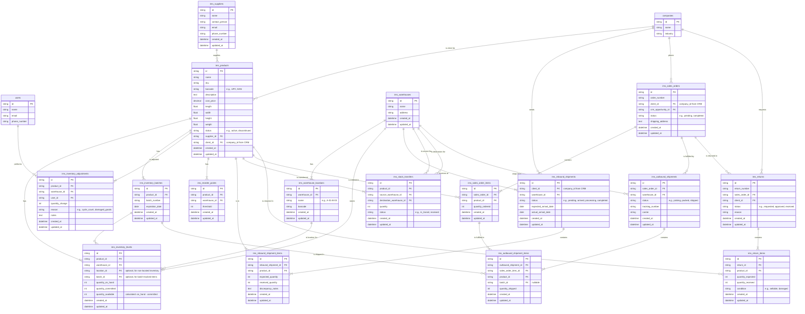

```mermaid
erDiagram
    %% Shared Entities (Defined in crm.md)
    users {
        string id PK
        string name
        string email
        string phone_number
    }

    companies {
        string id PK
        string name
        string industry
    }

    %% IMS (Inventory Management System)

    ims_products {
        string id PK
        string name
        string sku
        string barcode "e.g., UPC, EAN"
        text description
        decimal cost_price
        float length
        float width
        float height
        float weight
        string status "e.g., active, discontinued"
        string supplier_id FK
        string client_id FK "company_id from CRM"
        datetime created_at
        datetime updated_at
    }

    ims_suppliers {
        string id PK
        string name
        string contact_person
        string email
        string phone_number
        datetime created_at
        datetime updated_at
    }

    ims_warehouses {
        string id PK
        string name
        string address
        datetime created_at
        datetime updated_at
    }

    ims_warehouse_locations {
        string id PK
        string warehouse_id FK
        string name "e.g., A-01-B-03"
        string barcode
        datetime created_at
        datetime updated_at
    }

    ims_inventory_levels {
        string id PK
        string product_id FK
        string warehouse_id FK
        string location_id FK "optional, for non-located inventory"
        string batch_id FK "optional, for batch-tracked items"
        int quantity_on_hand
        int quantity_committed
        int quantity_available "calculated: on_hand - committed"
        datetime created_at
        datetime updated_at
    }

    ims_inventory_batches {
        string id PK
        string product_id FK
        string batch_number
        date expiration_date
        datetime created_at
        datetime updated_at
    }

    ims_inventory_adjustments {
        string id PK
        string product_id FK
        string warehouse_id FK
        string user_id FK
        int quantity_change
        string reason "e.g., cycle_count, damaged_goods"
        text notes
        datetime created_at
        datetime updated_at
    }

    ims_reorder_points {
        string id PK
        string product_id FK
        string warehouse_id FK
        int threshold
        datetime created_at
        datetime updated_at
    }

    ims_inbound_shipments {
        string id PK
        string client_id FK "company_id from CRM"
        string warehouse_id FK
        string status "e.g., pending, arrived, processing, completed"
        date expected_arrival_date
        date actual_arrival_date
        datetime created_at
        datetime updated_at
    }

    ims_inbound_shipment_items {
        string id PK
        string inbound_shipment_id FK
        string product_id FK
        int expected_quantity
        int received_quantity
        text discrepancy_notes
        datetime created_at
        datetime updated_at
    }

    ims_stock_transfers {
        string id PK
        string product_id FK
        string source_warehouse_id FK
        string destination_warehouse_id FK
        int quantity
        string status "e.g., in_transit, received"
        datetime created_at
        datetime updated_at
    }

    ims_sales_orders {
        string id PK
        string order_number
        string client_id FK "company_id from CRM"
        string crm_opportunity_id FK
        string status "e.g., pending, completed"
        text shipping_address
        datetime created_at
        datetime updated_at
    }

    ims_sales_order_items {
        string id PK
        string sales_order_id FK
        string product_id FK
        int quantity_ordered
        datetime created_at
        datetime updated_at
    }

    ims_outbound_shipments {
        string id PK
        string sales_order_id FK
        string warehouse_id FK
        string status "e.g., picking, packed, shipped"
        string tracking_number
        string carrier
        datetime created_at
        datetime updated_at
    }

    ims_outbound_shipment_items {
        string id PK
        string outbound_shipment_id FK
        string sales_order_item_id FK
        string product_id FK
        string batch_id FK "nullable"
        int quantity_shipped
        datetime created_at
        datetime updated_at
    }

    %% IMS Relationships
    companies           ||--o{ ims_products : "is client for"
    ims_suppliers       ||--o{ ims_products : "supplies"
    ims_products        ||--|{ ims_inventory_levels : "has"
    ims_products        ||--|{ ims_inventory_batches : "has"
    ims_products        ||--|{ ims_inventory_adjustments : "is adjusted"
    ims_products        ||--|{ ims_reorder_points : "has"
    ims_products        ||--|{ ims_inbound_shipment_items : "is in"
    ims_products        ||--|{ ims_stock_transfers : "is transferred"
    ims_warehouses      ||--|{ ims_warehouse_locations : "has"
    ims_warehouses      ||--|{ ims_inventory_levels : "stores"
    ims_warehouses      ||--|{ ims_inbound_shipments : "receives at"
    ims_warehouse_locations ||--o{ ims_inventory_levels : "is location for"
    ims_inventory_batches ||--o{ ims_inventory_levels : "is batch for"
    users               ||--o{ ims_inventory_adjustments : "performs"
    companies           ||--o{ ims_inbound_shipments : "sends"
    ims_inbound_shipments ||--|{ ims_inbound_shipment_items : "contains"
    ims_warehouses      ||--o{ ims_stock_transfers : "is source for"
    ims_warehouses      ||--o{ ims_stock_transfers : "is destination for"

    %% Outbound Relationships
    companies           ||--o{ ims_sales_orders : "places"
    ims_sales_orders    ||--|{ ims_sales_order_items : "contains"
    ims_products        ||--o{ ims_sales_order_items : "is ordered in"
    ims_sales_orders    ||--o{ ims_outbound_shipments : "is fulfilled by"
    ims_outbound_shipments ||--|{ ims_outbound_shipment_items : "contains"
    ims_sales_order_items ||--o{ ims_outbound_shipment_items : "is fulfilled in"
    ims_inventory_batches ||--o{ ims_outbound_shipment_items : "is shipped in"
    ims_warehouses      ||--o{ ims_outbound_shipments : "ships from"

    %% Reverse Logistics (Returns)
    ims_returns {
        string id PK
        string return_number
        string sales_order_id FK
        string client_id FK
        string status "e.g., requested, approved, received"
        string reason
        datetime created_at
        datetime updated_at
    }

    ims_return_items {
        string id PK
        string return_id FK
        string product_id FK
        int quantity_expected
        int quantity_received
        string condition "e.g., sellable, damaged"
        datetime created_at
        datetime updated_at
    }

    %% Return Relationships
    ims_sales_orders    ||--o{ ims_returns : "is returned in"
    companies           ||--o{ ims_returns : "requests"
    ims_returns         ||--|{ ims_return_items : "contains"
    ims_products        ||--o{ ims_return_items : "is returned in"
```
