```mermaid
erDiagram
    %% Shared Entities (Defined in crm.md and auth.md)
    users {
        string id PK
        string name
        string email
        string phone_number
    }

    companies {
        string id PK
        string name
        string industry
    }

    %% WMS-owned entities (referenced here instead of redefining IMS-local tables)
    wms_locations {
      string id PK
      string warehouse_id FK
      string name "e.g., A-01-B-03"
      string barcode
      string type "e.g., receiving_dock, pick_bin"
      float max_weight
      float max_volume
      datetime created_at
      datetime updated_at
    }

    wms_inventory_stock {
      string id PK
      string location_id FK
      string product_id FK
      string batch_id FK "nullable"
      int quantity
      string status "e.g., available, allocated, damaged"
      datetime created_at
      datetime updated_at
    }

    %% IMS (Inventory Management System)

    ims_products {
        string id PK
        string name
        string sku
        string barcode "e.g., UPC, EAN"
        text description
        decimal cost_price
        float length
        float width
        float height
        float weight
        string status "e.g., active, discontinued"
        string supplier_id FK
        string client_id FK "company_id from CRM"
        datetime created_at
        datetime updated_at
    }

    ims_suppliers {
      string id PK
      string name
      string contact_person
      string email
      string phone_number
      datetime created_at
      datetime updated_at
    }

    ims_inventory_batches {
        string id PK
        string product_id FK
        string batch_number
        date expiration_date
        datetime created_at
        datetime updated_at
    }

    ims_inventory_adjustments {
        string id PK
        string product_id FK
        string warehouse_id FK
        string user_id FK
        int quantity_change
        string reason "e.g., cycle_count, damaged_goods"
        text notes
        datetime created_at
        datetime updated_at
    }

    ims_reorder_points {
        string id PK
        string product_id FK
        string warehouse_id FK
        int threshold
        datetime created_at
        datetime updated_at
    }

    ims_inbound_shipments {
        string id PK
        string client_id FK "company_id from CRM"
        string warehouse_id FK
        string status "e.g., pending, arrived, processing, completed"
        date expected_arrival_date
        date actual_arrival_date
        datetime created_at
        datetime updated_at
    }

    ims_inbound_shipment_items {
        string id PK
        string inbound_shipment_id FK
        string product_id FK
        int expected_quantity
        int received_quantity
        text discrepancy_notes
        datetime created_at
        datetime updated_at
    }

    ims_stock_transfers {
        string id PK
        string product_id FK
        string source_warehouse_id FK
        string destination_warehouse_id FK
        int quantity
        string status "e.g., in_transit, received"
        datetime created_at
        datetime updated_at
    }

    ims_sales_orders {
        string id PK
        string order_number
        string client_id FK "company_id from CRM"
        string crm_opportunity_id FK
        string status "e.g., pending, completed"
        text shipping_address
        datetime created_at
        datetime updated_at
    }

    ims_sales_order_items {
        string id PK
        string sales_order_id FK
        string product_id FK
        int quantity_ordered
        datetime created_at
        datetime updated_at
    }

    ims_outbound_shipments {
        string id PK
        string sales_order_id FK
        string warehouse_id FK
        string status "e.g., picking, packed, shipped"
        string tracking_number
        string carrier
        datetime created_at
        datetime updated_at
    }

    ims_outbound_shipment_items {
        string id PK
        string outbound_shipment_id FK
        string sales_order_item_id FK
        string product_id FK
        string batch_id FK "nullable"
        int quantity_shipped
        datetime created_at
        datetime updated_at
    }

    %% IMS Relationships
    companies           ||--o{ ims_products : "is client for"
    ims_suppliers       ||--o{ ims_products : "supplies"
    ims_products        ||--|{ wms_inventory_stock : "has"
    ims_products        ||--|{ ims_inventory_batches : "has"
    ims_products        ||--|{ ims_inventory_adjustments : "is adjusted"
    ims_products        ||--|{ ims_reorder_points : "has"
    ims_products        ||--|{ ims_inbound_shipment_items : "is in"
    ims_products        ||--|{ ims_stock_transfers : "is transferred"
    wms_warehouses      ||--o{ wms_locations : "has"
    wms_warehouses      ||--|{ wms_inventory_stock : "stores"
    wms_warehouses      ||--|{ ims_inbound_shipments : "receives at"
    wms_locations ||--o{ wms_inventory_stock : "is location for"
    ims_inventory_batches ||--o{ wms_inventory_stock : "is batch for"
    users               ||--o{ ims_inventory_adjustments : "performs"
    companies           ||--o{ ims_inbound_shipments : "sends"
    ims_inbound_shipments ||--|{ ims_inbound_shipment_items : "contains"
    wms_warehouses      ||--o{ ims_stock_transfers : "is source for"
    wms_warehouses      ||--o{ ims_stock_transfers : "is destination for"

    %% Outbound Relationships
    companies           ||--o{ ims_sales_orders : "places"
    ims_sales_orders    ||--|{ ims_sales_order_items : "contains"
    ims_products        ||--o{ ims_sales_order_items : "is ordered in"
    ims_sales_orders    ||--o{ ims_outbound_shipments : "is fulfilled by"
    ims_outbound_shipments ||--|{ ims_outbound_shipment_items : "contains"
    ims_sales_order_items ||--o{ ims_outbound_shipment_items : "is fulfilled in"
    ims_inventory_batches ||--o{ ims_outbound_shipment_items : "is shipped in"
    wms_warehouses      ||--o{ ims_outbound_shipments : "ships from"

    %% Reverse Logistics (Returns)
    ims_returns {
        string id PK
        string return_number
        string sales_order_id FK
        string client_id FK
        string status "e.g., requested, approved, received"
        string reason
        datetime created_at
        datetime updated_at
    }

    ims_return_items {
        string id PK
        string return_id FK
        string product_id FK
        int quantity_expected
        int quantity_received
        string condition "e.g., sellable, damaged"
        datetime created_at
        datetime updated_at
    }

    %% Return Relationships
    ims_sales_orders    ||--o{ ims_returns : "is returned in"
    companies           ||--o{ ims_returns : "requests"
    ims_returns         ||--|{ ims_return_items : "contains"
    ims_products        ||--o{ ims_return_items : "is returned in"
```

## IMS Domain Explanation

The IMS (Inventory Management System) domain is a core component of the
logistics-management-system, designed to provide comprehensive tracking and
control over physical inventory. Its primary purpose is to maintain an accurate,
real-time record of all products, their quantities, and their locations within
one or more warehouses. This domain handles the entire lifecycle of inventory,
from receiving inbound shipments and managing stock levels to fulfilling
outbound orders and processing returns.

The IMS is tightly integrated with other domains. It pulls client and sales
order data from the [CRM](./crm.md), ensuring customer information and orders
are synchronized with inventory processes. IMS owns the product master, batches,
inventory adjustments, reorder points, and the high-level inbound/ outbound
shipment records used for planning and accounting.

The WMS (Warehouse Management System) is authoritative for physical storage and
per-location inventory (location hierarchy, bin capacity, and location-level
stock). See [WMS](./wms.md) for the canonical WMS schema and operational
details. IMS provides the foundational data the WMS consumes to optimize
putaway, picking, replenishment and to feed the **TMS (Transportation Management
System)** for shipment execution.

Key actors in this domain include:

- **Inventory Managers**: Oversee the product catalog and stock level accuracy.
- **Warehouse Managers**: Manage warehouse operations and real-time stock
  visibility.
- **Warehouse Operators**: Perform physical tasks like receiving, picking, and
  cycle counting, often using barcode scanners.
- **Account Managers**: Configure client-specific settings, such as low stock
  alerts.
- **Logistics Coordinators**: Manage stock distribution across multiple
  warehouses.
- **Quality Control Managers**: Handle batch/lot tracking and recalls.

Below is a detailed explanation of each entity and its key fields (excluding the
redundant fields `id`, `created_at`, and `updated_at`).

### ims_products

Represents the master record for each unique product (SKU) managed in the
inventory.

- `name`: The common name of the product.
- `sku`: The unique Stock Keeping Unit identifier.
- `barcode`: The product's barcode (e.g., UPC, EAN) for scanning.
- `description`: Detailed information about the product.
- `cost_price`: The purchase price or cost of the product.
- `length`, `width`, `height`, `weight`: Physical dimensions and weight for
  storage and shipping calculations.
- `status`: The product's lifecycle status (e.g., `active`, `discontinued`).
- `supplier_id`: A reference to the product's supplier.
- `client_id`: A reference to the client company (from CRM) that owns this
  inventory.

### ims_suppliers

Stores information about the suppliers who provide the products.

- `name`: The name of the supplier company.
- `contact_person`: The primary contact at the supplier.
- `email`: The supplier's contact email.
- `phone_number`: The supplier's contact phone number.

### Warehouse locations & per-location inventory (WMS-owned)

Location hierarchy and per-location inventory are owned and managed by the
Warehouse Management System (WMS). The IMS domain references those canonical
entities rather than redefining them. See `docs/diagrams/wms.md` for the full
schema and operational details.

- `wms_locations`: canonical representation of physical storage locations
  (hierarchy, barcode, type, capacity limits, etc.).
- `wms_inventory_stock`: per-location stock records (location_id, product_id,
  batch_id, quantity, status) used for real-time location-level inventory.

In this documentation, any references to "warehouse locations" or "inventory
levels" should be interpreted as references to the WMS entities above. IMS
continues to own product master data, batches, adjustments, reorder points,
inbound/outbound shipments, and higher-level inventory concepts (aggregates,
adjustments, transfers), while the WMS is authoritative for location-level
placement and operational stock.

### ims_inventory_batches

Stores information for products that are tracked by batch or lot, essential for
quality control and recalls.

- `product_id`: The product associated with this batch.
- `batch_number`: The unique identifier for the batch/lot.
- `expiration_date`: The expiration date of the products in this batch.

### ims_inventory_adjustments

Logs any manual changes made to inventory levels to maintain accuracy.

- `product_id`: The product being adjusted.
- `warehouse_id`: The warehouse where the adjustment occurred.
- `user_id`: The user who performed the adjustment.
- `quantity_change`: The amount by which the quantity was changed (can be
  positive or negative).
- `reason`: The reason for the adjustment (e.g., `cycle_count`,
  `damaged_goods`).
- `notes`: Additional details about the adjustment.

### ims_reorder_points

Defines the minimum stock level for a product that triggers a low stock alert.

- `product_id`: The product to monitor.
- `warehouse_id`: The specific warehouse to monitor the stock level in.
- `threshold`: The minimum quantity that triggers the alert.

### ims_inbound_shipments

Represents an expected inbound shipment from a client or supplier (also known as
an Advance Shipping Notice or ASN).

- `client_id`: The client company sending the inventory.
- `warehouse_id`: The destination warehouse.
- `status`: The current status of the shipment (e.g., `pending`, `arrived`,
  `completed`).
- `expected_arrival_date`: The planned arrival date.
- `actual_arrival_date`: The date the shipment actually arrived.

### ims_inbound_shipment_items

Details the specific products and quantities expected in an inbound shipment.

- `inbound_shipment_id`: A reference to the parent inbound shipment.
- `product_id`: The product included in the shipment.
- `expected_quantity`: The quantity declared on the ASN.
- `received_quantity`: The actual quantity counted upon receipt.
- `discrepancy_notes`: Notes detailing any differences between expected and
  received quantities.

### ims_stock_transfers

Tracks the movement of inventory from one warehouse to another.

- `product_id`: The product being transferred.
- `source_warehouse_id`: The warehouse the stock is moving from.
- `destination_warehouse_id`: The warehouse the stock is moving to.
- `quantity`: The amount of stock being transferred.
- `status`: The status of the transfer (e.g., `in_transit`, `received`).

### ims_sales_orders

Represents a customer's order, often originating from the CRM, which needs to be
fulfilled from inventory.

- `order_number`: A unique identifier for the sales order.
- `client_id`: The client company that placed the order.
- `crm_opportunity_id`: A link back to the original opportunity in the CRM.
- `status`: The fulfillment status of the order (e.g., `pending`, `completed`).
- `shipping_address`: The address where the order should be shipped.

### ims_sales_order_items

Details the specific products and quantities required for a sales order.

- `sales_order_id`: A reference to the parent sales order.
- `product_id`: The product being ordered.
- `quantity_ordered`: The quantity of the product requested by the customer.

### ims_outbound_shipments

Represents the physical shipment created to fulfill a sales order.

- `sales_order_id`: The sales order being fulfilled.
- `warehouse_id`: The warehouse the shipment is being sent from.
- `status`: The status of the outbound shipment (e.g., `picking`, `packed`,
  `shipped`).
- `tracking_number`: The carrier tracking number for the shipment.
- `carrier`: The shipping carrier (e.g., FedEx, UPS).

### ims_outbound_shipment_items

Details the specific items, quantities, and batches included in an outbound
shipment.

- `outbound_shipment_id`: A reference to the parent outbound shipment.
- `sales_order_item_id`: A link to the specific line item on the sales order.
- `product_id`: The product being shipped.
- `batch_id`: The specific batch the item was picked from (if applicable).
- `quantity_shipped`: The quantity of the product included in this shipment.

### ims_returns

Represents a return request from a client (Reverse Logistics).

- `return_number`: A unique identifier for the return.
- `sales_order_id`: A reference to the original sales order being returned.
- `client_id`: The client initiating the return.
- `status`: The status of the return (e.g., `requested`, `approved`,
  `received`).
- `reason`: The reason for the return.

### ims_return_items

Details the specific products and quantities being returned.

- `return_id`: A reference to the parent return record.
- `product_id`: The product being returned.
- `quantity_expected`: The quantity the client stated they would return.
- `quantity_received`: The actual quantity received at the warehouse.
- `condition`: The condition of the returned item (e.g., `sellable`, `damaged`).
