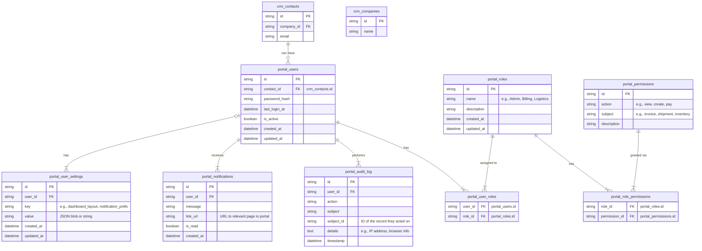

```mermaid
erDiagram
    %% Shared Entities (Defined in other diagrams)
    crm_contacts {
        string id PK
        string company_id FK
        string email
    }
    crm_companies {
        string id PK
        string name
    }

    %% PORTAL - Access Control & User Experience

    portal_users {
        string id PK
        string contact_id FK "crm_contacts.id"
        string password_hash
        datetime last_login_at
        boolean is_active
        datetime created_at
        datetime updated_at
    }

    portal_roles {
        string id PK
        string name "e.g., Admin, Billing, Logistics"
        string description
        datetime created_at
        datetime updated_at
    }

    portal_permissions {
        string id PK
        string action "e.g., view, create, pay"
        string subject "e.g., invoice, shipment, inventory"
        string description
    }

    portal_user_roles {
        string user_id FK "portal_users.id"
        string role_id FK "portal_roles.id"
    }

    portal_role_permissions {
        string role_id FK "portal_roles.id"
        string permission_id FK "portal_permissions.id"
    }

    portal_user_settings {
        string id PK
        string user_id FK
        string key "e.g., dashboard_layout, notification_prefs"
        string value "JSON blob or string"
        datetime created_at
        datetime updated_at
    }

    portal_notifications {
        string id PK
        string user_id FK
        string message
        string link_url "URL to relevant page in portal"
        boolean is_read
        datetime created_at
    }

    portal_audit_log {
        string id PK
        string user_id FK
        string action
        string subject
        string subject_id "ID of the record they acted on"
        text details "e.g., IP address, browser info"
        datetime timestamp
    }


    %% Relationships
    crm_contacts            ||--o{ portal_users : "can have"

    portal_users            |o--|{ portal_user_settings : "has"
    portal_users            ||--|{ portal_notifications : "receives"
    portal_users            ||--|{ portal_audit_log : "performs"

    %% RBAC Relationships
    portal_users            ||--|{ portal_user_roles : "has"
    portal_roles            ||--|{ portal_user_roles : "assigned to"
    portal_roles            ||--|{ portal_role_permissions : "has"
    portal_permissions      ||--|{ portal_role_permissions : "granted via"
```
