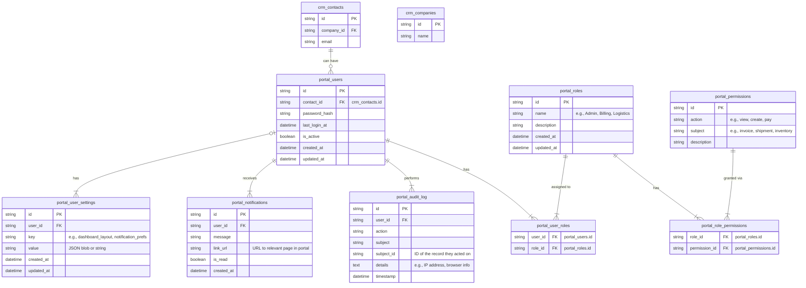

## Portal Domain Explanation

The Portal System provides secure client access to the logistics platform
through a web-based interface. It manages user authentication, authorization,
and personalized experiences for clients to interact with their logistics data.
The portal serves as the primary customer-facing interface where clients can
track shipments, view invoices, manage their accounts, and access various
logistics services. The portal integrates closely with the Customer Relationship
Management ([CRM](./crm.md)) system for client information and connects to all
other domains to provide comprehensive access to logistics data.

Actors involved in this system include client administrators, company employees,
billing managers, logistics coordinators, and end customers. These roles
interact with the portal to perform tasks such as managing user access,
configuring company settings, tracking shipments, paying invoices, generating
reports, and communicating with the logistics provider.

Below is a detailed explanation of each entity and its key fields (excluding the
redundant fields `id`, `created_at`, and `updated_at`).

### Portal Users

Represents client users who have access to the web portal interface.

- `contact_id`: Reference to the contact record in the CRM system.
- `password_hash`: Securely hashed password for authentication.
- `last_login_at`: Timestamp of the user's most recent login.
- `is_active`: Whether the user account is currently enabled.

### Portal Roles

Defines different levels of access and responsibility within the portal system.

- `name`: Role designation (e.g., Admin, Billing, Logistics).
- `description`: Detailed explanation of the role's purpose and scope.

### Portal Permissions

Granular permissions that control what actions users can perform on specific
resources.

- `action`: The operation that can be performed (e.g., view, create, pay).
- `subject`: The resource or entity the action applies to (e.g., invoice,
  shipment, inventory).
- `description`: Human-readable explanation of what this permission allows.

### Portal User Roles

Associates users with their assigned roles, enabling role-based access control.

- `user_id`: Reference to the portal user.
- `role_id`: Reference to the assigned role.

### Portal Role Permissions

Links roles to their granted permissions, defining what each role is authorized
to do.

- `role_id`: Reference to the role receiving permissions.
- `permission_id`: Reference to the specific permission being granted.

### Portal User Settings

Stores personalized configuration preferences for individual users.

- `user_id`: Reference to the user whose settings are being stored.
- `key`: Setting identifier (e.g., dashboard_layout, notification_prefs).
- `value`: Setting value, which can be a JSON blob or simple string.

### Portal Notifications

In-portal messaging system for alerting users about important events and
updates.

- `user_id`: Reference to the user receiving the notification.
- `message`: Content of the notification message.
- `link_url`: URL to relevant page in portal for further action or information.
- `is_read`: Whether the user has viewed the notification.

### Portal Audit Log

Security and compliance logging that tracks all user actions within the portal.

- `user_id`: Reference to the user who performed the action.
- `action`: Description of what action was performed.
- `subject`: Type of resource or entity that was acted upon.
- `subject_id`: Specific ID of the record that was accessed or modified.
- `details`: Additional context such as IP address and browser information.
- `timestamp`: When the action occurred.
