```mermaid
erDiagram
    %% Shared Entities (Defined in other diagrams)
    users {
        string id PK
        string name
        string email
    }

    ims_outbound_shipments {
        string id PK
        string tracking_number
    }

    %% TMS (Transportation Management System)

    tms_drivers {
        string id PK
        string user_id FK
        string license_number
        date license_expiry_date
        string status "e.g., active, inactive, on_leave"
        datetime created_at
        datetime updated_at
    }

    tms_driver_schedules {
        string id PK
        string driver_id FK
        date start_date
        date end_date
        string reason "e.g., vacation, sick_leave"
        datetime created_at
        datetime updated_at
    }

    tms_vehicles {
        string id PK
        string registration_number
        string model
        float capacity_volume
        float capacity_weight
        string status "e.g., available, in_maintenance, on_trip"
        datetime created_at
        datetime updated_at
    }

    tms_vehicle_maintenance {
        string id PK
        string vehicle_id FK
        date service_date
        string service_type
        decimal cost
        text notes
        datetime created_at
        datetime updated_at
    }

    tms_trips {
        string id PK
        string driver_id FK
        string vehicle_id FK
        string status "e.g., planned, in_progress, completed, cancelled"
        datetime created_at
        datetime updated_at
    }

    tms_trip_stops {
        string id PK
        string trip_id FK
        string shipment_id FK "from ims_outbound_shipments"
        int sequence
        string address
        string status "e.g., pending, arrived, completed"
        datetime estimated_arrival_time
        datetime actual_arrival_time
        datetime estimated_departure_time
        datetime actual_departure_time
        datetime created_at
        datetime updated_at
    }

    tms_gps_pings {
        string id PK
        string vehicle_id FK
        float latitude
        float longitude
        datetime timestamp
    }

    tms_routes {
        string id PK
        string trip_id FK
        text optimized_route_data "e.g., polyline, turn-by-turn directions"
        float total_distance
        float total_duration
        datetime created_at
        datetime updated_at
    }

    tms_proof_of_deliveries {
        string id PK
        string trip_stop_id FK
        string type "e.g., signature, photo"
        string file_path
        datetime timestamp
        float latitude
        float longitude
        datetime created_at
        datetime updated_at
    }

    tms_expenses {
        string id PK
        string trip_id FK
        string driver_id FK
        string type "e.g., fuel, tolls, maintenance"
        decimal amount
        string currency
        string receipt_url
        float fuel_quantity "nullable"
        int odometer_reading "nullable"
        string status "e.g., pending, approved, rejected"
        datetime created_at
        datetime updated_at
    }

    tms_geofences {
        string id PK
        string name
        text coordinates "e.g., polygon data"
        datetime created_at
        datetime updated_at
    }

    tms_geofence_events {
        string id PK
        string vehicle_id FK
        string geofence_id FK
        string event_type "e.g., enter, exit"
        datetime timestamp
    }

    tms_carriers {
        string id PK
        string name
        string contact_details
        text services_offered
        datetime created_at
        datetime updated_at
    }

    tms_carrier_rates {
        string id PK
        string carrier_id FK
        string service_type
        string origin
        string destination
        decimal rate
        string unit "e.g., per_kg, per_container"
        datetime created_at
        datetime updated_at
    }

    tms_shipment_legs {
        string id PK
        string shipment_id FK
        int leg_sequence
        string start_location
        string end_location
        string carrier_id FK "nullable, for 3rd party"
        string internal_trip_id FK "nullable, for internal fleet"
        string status
        datetime created_at
        datetime updated_at
    }

    tms_shipment_leg_events {
        string id PK
        string shipment_leg_id FK
        string status_message
        string location
        datetime event_timestamp
    }

    tms_partner_invoices {
        string id PK
        string carrier_id FK
        string invoice_number
        date invoice_date
        decimal total_amount
        string status "e.g., pending, paid, disputed"
        datetime created_at
        datetime updated_at
    }

    tms_partner_invoice_items {
        string id PK
        string partner_invoice_id FK
        string shipment_leg_id FK
        decimal amount
    }

    %% TMS Relationships
    users                   ||--o{ tms_drivers : "is a"
    tms_drivers             ||--|{ tms_driver_schedules : "has"
    tms_vehicles            ||--|{ tms_vehicle_maintenance : "undergoes"
    tms_drivers             ||--o{ tms_trips : "drives"
    tms_vehicles            ||--o{ tms_trips : "is used in"
    tms_trips               ||--|{ tms_trip_stops : "consists of"
    ims_outbound_shipments  ||--o{ tms_trip_stops : "is delivered in"
    tms_trips               ||--o{ tms_routes : "follows"
    tms_trip_stops          ||--o{ tms_proof_of_deliveries : "has"
    tms_trips               ||--o{ tms_expenses : "incurs"
    tms_drivers             ||--o{ tms_expenses : "logs"
    tms_vehicles            ||--|{ tms_gps_pings : "sends"
    tms_vehicles            ||--o{ tms_geofence_events : "triggers"
    tms_geofences           ||--o{ tms_geofence_events : "is boundary for"
    
    %% Multi-Leg & Carrier Relationships
    ims_outbound_shipments  ||--|{ tms_shipment_legs : "is composed of"
    tms_carriers            ||--o{ tms_shipment_legs : "handles"
    tms_carriers            ||--|{ tms_carrier_rates : "defines"
    tms_shipment_legs       ||--|{ tms_shipment_leg_events : "has"
    tms_trips               ||--o{ tms_shipment_legs : "handles internal"
    tms_carriers            ||--o{ tms_partner_invoices : "sends"
    tms_partner_invoices    ||--|{ tms_partner_invoice_items : "contains"
    tms_shipment_legs       ||--o{ tms_partner_invoice_items : "is billed in"
```

## TMS Domain Explanation

The Transportation Management System (TMS) is a core component of the logistics
platform that manages the movement of goods from origin to destination. It
orchestrates the entire transportation process, including fleet management,
route optimization, driver coordination, and carrier partnerships. The TMS
integrates seamlessly with the Inventory Management System ([IMS](./ims.md)) for
shipment coordination and the Delivery Management System ([DMS](./dms.md)) for
last-mile delivery operations.

Actors involved in this system include fleet managers, drivers, dispatchers,
logistics coordinators, transportation planners, carrier partners, and
administrative staff. These roles interact with the TMS to perform tasks such as
planning optimal routes, managing vehicle maintenance, tracking shipments in
real-time, coordinating with third-party carriers, and monitoring transportation
costs and performance.

Below is a detailed explanation of each entity and its key fields (excluding the
redundant fields `id`, `created_at`, and `updated_at`).

### TMS Drivers

Represents drivers who operate vehicles within the transportation fleet.

- `user_id`: Reference to the user account in the system.
- `license_number`: Driver's license identification number.
- `license_expiry_date`: When the driver's license expires.
- `status`: Current availability status (e.g., active, inactive, on_leave).

### TMS Driver Schedules

Tracks driver availability and planned time off for scheduling purposes.

- `driver_id`: Reference to the associated driver.
- `start_date`: Beginning of the schedule period.
- `end_date`: End of the schedule period.
- `reason`: Purpose of the schedule entry (e.g., vacation, sick_leave).

### TMS Vehicles

Manages the fleet of vehicles available for transportation operations.

- `registration_number`: Vehicle's license plate or registration identifier.
- `model`: Vehicle make and model information.
- `capacity_volume`: Maximum cargo volume the vehicle can carry.
- `capacity_weight`: Maximum weight capacity of the vehicle.
- `status`: Current vehicle status (e.g., available, in_maintenance, on_trip).

### TMS Vehicle Maintenance

Tracks maintenance activities and service history for fleet vehicles.

- `vehicle_id`: Reference to the vehicle being serviced.
- `service_date`: Date when maintenance was performed.
- `service_type`: Type of maintenance or repair work.
- `cost`: Financial cost of the maintenance service.
- `notes`: Additional details about the maintenance work.

### TMS Trips

Represents planned or active transportation journeys with assigned drivers and
vehicles.

- `driver_id`: Reference to the assigned driver.
- `vehicle_id`: Reference to the assigned vehicle.
- `status`: Current trip status (e.g., planned, in_progress, completed,
  cancelled).

### TMS Trip Stops

Individual stops within a trip, typically for pickups or deliveries.

- `trip_id`: Reference to the parent trip.
- `shipment_id`: Reference to the shipment being handled at this stop.
- `sequence`: Order of this stop within the trip.
- `address`: Physical location of the stop.
- `status`: Current stop status (e.g., pending, arrived, completed).
- `estimated_arrival_time`: Planned arrival time at the stop.
- `actual_arrival_time`: Actual recorded arrival time.
- `estimated_departure_time`: Planned departure time from the stop.
- `actual_departure_time`: Actual recorded departure time.

### TMS GPS Pings

Real-time location data from vehicles for tracking and monitoring purposes.

- `vehicle_id`: Reference to the vehicle sending the location data.
- `latitude`: Geographic latitude coordinate.
- `longitude`: Geographic longitude coordinate.
- `timestamp`: When the location was recorded.

### TMS Routes

Optimized route information for trips, including navigation data.

- `trip_id`: Reference to the associated trip.
- `optimized_route_data`: Route optimization data such as polylines and
  turn-by-turn directions.
- `total_distance`: Calculated total distance of the route.
- `total_duration`: Estimated total time for the route.

### TMS Proof of Deliveries

Evidence of successful deliveries or pickups at trip stops.

- `trip_stop_id`: Reference to the trip stop where proof was collected.
- `type`: Type of proof collected (e.g., signature, photo).
- `file_path`: Storage location of the proof file.
- `timestamp`: When the proof was collected.
- `latitude`: Geographic latitude where proof was collected.
- `longitude`: Geographic longitude where proof was collected.

### TMS Expenses

Tracks transportation-related expenses incurred during trips.

- `trip_id`: Reference to the associated trip.
- `driver_id`: Reference to the driver who logged the expense.
- `type`: Category of expense (e.g., fuel, tolls, maintenance).
- `amount`: Financial amount of the expense.
- `currency`: Currency denomination of the expense.
- `receipt_url`: Link to receipt or proof of purchase.
- `fuel_quantity`: Amount of fuel purchased (if applicable).
- `odometer_reading`: Vehicle odometer reading at time of expense.
- `status`: Approval status (e.g., pending, approved, rejected).

### TMS Geofences

Defines geographic boundaries for monitoring vehicle movements and triggering
events.

- `name`: Descriptive name for the geofenced area.
- `coordinates`: Geographic boundary data (e.g., polygon coordinates).

### TMS Geofence Events

Records when vehicles enter or exit predefined geographic areas.

- `vehicle_id`: Reference to the vehicle that triggered the event.
- `geofence_id`: Reference to the geofenced area.
- `event_type`: Type of boundary event (e.g., enter, exit).
- `timestamp`: When the event occurred.

### TMS Carriers

Information about third-party transportation providers and partners.

- `name`: Carrier company name.
- `contact_details`: Contact information for the carrier.
- `services_offered`: Description of transportation services provided.

### TMS Carrier Rates

Pricing information for services provided by third-party carriers.

- `carrier_id`: Reference to the carrier providing the service.
- `service_type`: Type of transportation service.
- `origin`: Starting location for the service.
- `destination`: Ending location for the service.
- `rate`: Cost for the service.
- `unit`: Pricing unit (e.g., per_kg, per_container).

### TMS Shipment Legs

Represents individual segments of multi-leg shipments that may involve different
carriers or internal fleet.

- `shipment_id`: Reference to the overall shipment.
- `leg_sequence`: Order of this leg within the shipment journey.
- `start_location`: Starting point of this leg.
- `end_location`: Ending point of this leg.
- `carrier_id`: Reference to third-party carrier (if external).
- `internal_trip_id`: Reference to internal trip (if using own fleet).
- `status`: Current status of this shipment leg.

### TMS Shipment Leg Events

Tracks status updates and events for individual shipment legs.

- `shipment_leg_id`: Reference to the associated shipment leg.
- `status_message`: Description of the status or event.
- `location`: Geographic location where the event occurred.
- `event_timestamp`: When the event was recorded.

### TMS Partner Invoices

Billing records from third-party carriers for transportation services.

- `carrier_id`: Reference to the carrier sending the invoice.
- `invoice_number`: Carrier's invoice identifier.
- `invoice_date`: Date the invoice was issued.
- `total_amount`: Total amount billed on the invoice.
- `status`: Payment status (e.g., pending, paid, disputed).

### TMS Partner Invoice Items

Individual line items on carrier invoices, detailing specific shipment leg
charges.

- `partner_invoice_id`: Reference to the parent invoice.
- `shipment_leg_id`: Reference to the specific shipment leg being billed.
- `amount`: Amount charged for this specific shipment leg.
