```mermaid
erDiagram
    %% Shared Entities (Defined in other diagrams)
    users {
        string id PK
        string name
    }
    ims_products {
        string id PK
        string name
        string sku
    }
    ims_inbound_shipments {
        string id PK
        string client_id
    }
    ims_sales_orders {
        string id PK
        string order_number
    }
    ims_returns {
        string id PK
        string return_number
    }
    ims_inventory_batches {
        string id PK
        string batch_number
    }

    %% WMS (Warehouse Management System)

    wms_locations {
        string id PK
        string warehouse_id FK
        string parent_location_id FK "self-referencing for hierarchy"
        string name "e.g., A-01-B-101"
        string barcode
        string type "e.g., receiving_dock, pick_bin, packing_station, cross_dock_area"
        float max_weight
        float max_volume
        datetime created_at
        datetime updated_at
    }

    wms_inventory_stock {
        string id PK
        string location_id FK
        string product_id FK
        string batch_id FK "nullable"
        int quantity
        string status "e.g., available, allocated, damaged"
        datetime created_at
        datetime updated_at
    }

    wms_putaway_rules {
        string id PK
        string product_id FK
        string client_id FK
        string preferred_location_id FK
        int priority
        datetime created_at
        datetime updated_at
    }

    wms_bin_thresholds {
        string id PK
        string location_id FK
        string product_id FK
        int min_quantity
        int max_quantity
        datetime created_at
        datetime updated_at
    }

    wms_pick_batches {
        string id PK
        string status "e.g., open, in_progress, completed"
        string strategy "e.g., batch_picking, zone_picking"
        datetime created_at
        datetime updated_at
    }

    wms_pick_batch_items {
        string pick_batch_id PK, FK
        string sales_order_id PK, FK
    }

    wms_tasks {
        string id PK
        string user_id FK
        string type "e.g., putaway, pick, pack, replenishment, cycle_count, cross_dock"
        string status "e.g., pending, in_progress, completed"
        string source_entity_id "e.g., inbound_shipment_id, pick_batch_id, return_id"
        datetime start_time
        datetime end_time
        int duration_seconds
        datetime created_at
        datetime updated_at
    }

    wms_task_items {
        string id PK
        string task_id FK
        string product_id FK
        string source_location_id FK
        string destination_location_id FK
        int quantity_required
        int quantity_completed
        string status "e.g., pending, completed"
        datetime created_at
        datetime updated_at
    }

    wms_packages {
        string id PK
        string sales_order_id FK
        string package_number
        float weight
        float length
        float width
        float height
        datetime created_at
        datetime updated_at
    }

    wms_package_items {
        string id PK
        string package_id FK
        string product_id FK
        int quantity
        datetime created_at
        datetime updated_at
    }

    %% WMS Relationships
    users                   ||--o{ wms_tasks : "performs"
    wms_locations           ||--o{ wms_locations : "is parent of"
    wms_locations           ||--o{ wms_bin_thresholds : "has"
    ims_products            ||--o{ wms_putaway_rules : "has"
    wms_locations           ||--o{ wms_putaway_rules : "is preferred for"
    
    %% Inventory Stock Relationships
    wms_locations           ||--|{ wms_inventory_stock : "holds"
    ims_products            ||--|{ wms_inventory_stock : "is instance of"
    ims_inventory_batches   ||--o{ wms_inventory_stock : "is batch of"

    %% Task & Workflow Relationships
    wms_tasks               ||--|{ wms_task_items : "consists of"
    wms_locations           ||--o{ wms_task_items : "is source for"
    wms_locations           ||--o{ wms_task_items : "is destination for"
    ims_products            ||--o{ wms_task_items : "is subject of"
    
    %% Picking & Packing Relationships
    wms_pick_batches        ||--|{ wms_pick_batch_items : "groups"
    ims_sales_orders        ||--o{ wms_pick_batch_items : "is part of"
    wms_pick_batches        ||--o{ wms_tasks : "generates"
    ims_sales_orders        ||--|{ wms_packages : "is packed into"
    wms_packages            ||--|{ wms_package_items : "contains"
    ims_products            ||--o{ wms_package_items : "is"

    %% Process Trigger Relationships
    ims_inbound_shipments   ||--o{ wms_tasks : "triggers putaway"
    wms_bin_thresholds      ||--o{ wms_tasks : "triggers replenishment"
    ims_returns             ||--o{ wms_tasks : "triggers returns processing"
```

## WMS Domain Explanation

The Warehouse Management System (WMS) is a fundamental component of the
logistics platform that orchestrates all warehouse operations from receiving to
shipping. It manages inventory placement, optimizes warehouse workflows,
coordinates picking and packing activities, and ensures accurate inventory
tracking throughout the warehouse. The WMS integrates closely with the Inventory
Management System ([IMS](./ims.md)) for product and stock management, the
Transportation Management System ([TMS](./tms.md)) for shipment coordination,
and the Delivery Management System ([DMS](./dms.md)) for package handoff.

Actors involved in this system include warehouse managers, warehouse workers,
inventory specialists, pick and pack operators, receiving clerks, quality
control personnel, and supervisors. These roles interact with the WMS to perform
tasks such as receiving inventory, organizing stock placement, executing pick
lists, packing orders, managing returns, conducting cycle counts, and monitoring
warehouse performance metrics.

Below is a detailed explanation of each entity and its key fields (excluding the
redundant fields `id`, `created_at`, and `updated_at`).

### WMS Locations

Represents physical storage locations within the warehouse, organized in a
hierarchical structure.

- `warehouse_id`: Reference to the warehouse facility.
- `parent_location_id`: Reference to parent location for hierarchical
  organization (e.g., zone > aisle > shelf > bin).
- `name`: Human-readable location identifier (e.g., A-01-B-101).
- `barcode`: Machine-readable location identifier for scanning operations.
- `type`: Classification of location purpose (e.g., receiving_dock, pick_bin,
  packing_station, cross_dock_area).
- `max_weight`: Maximum weight capacity for the location.
- `max_volume`: Maximum volume capacity for the location.

### WMS Inventory Stock

Tracks actual physical inventory quantities at specific warehouse locations.

- `location_id`: Reference to the physical location where stock is stored.
- `product_id`: Reference to the product being stored.
- `batch_id`: Reference to the inventory batch (if applicable for lot tracking).
- `quantity`: Current quantity of product at this location.
- `status`: Current state of the inventory (e.g., available, allocated,
  damaged).

### WMS Putaway Rules

Defines automated rules for determining where incoming inventory should be
stored.

- `product_id`: Reference to the product the rule applies to.
- `client_id`: Reference to the client (for multi-tenant warehouses).
- `preferred_location_id`: Reference to the preferred storage location.
- `priority`: Rule precedence when multiple rules could apply.

### WMS Bin Thresholds

Defines minimum and maximum stock levels for specific products at specific
locations to trigger replenishment.

- `location_id`: Reference to the storage location.
- `product_id`: Reference to the product being monitored.
- `min_quantity`: Minimum stock level that triggers replenishment.
- `max_quantity`: Maximum stock level for the location.

### WMS Pick Batches

Groups multiple sales orders together for efficient batch picking operations.

- `status`: Current batch status (e.g., open, in_progress, completed).
- `strategy`: Picking strategy employed (e.g., batch_picking, zone_picking).

### WMS Pick Batch Items

Associates individual sales orders with pick batches for grouped picking.

- `pick_batch_id`: Reference to the pick batch.
- `sales_order_id`: Reference to the sales order included in the batch.

### WMS Tasks

Represents individual work assignments for warehouse personnel.

- `user_id`: Reference to the assigned warehouse worker.
- `type`: Category of warehouse task (e.g., putaway, pick, pack, replenishment,
  cycle_count, cross_dock).
- `status`: Current task status (e.g., pending, in_progress, completed).
- `source_entity_id`: Reference to the entity that triggered the task (e.g.,
  inbound_shipment_id, pick_batch_id).
- `start_time`: When the task was started.
- `end_time`: When the task was completed.
- `duration_seconds`: Total time taken to complete the task.

### WMS Task Items

Individual line items within a warehouse task, specifying exactly what needs to
be moved or processed.

- `task_id`: Reference to the parent task.
- `product_id`: Reference to the product being handled.
- `source_location_id`: Reference to where the product should be picked from.
- `destination_location_id`: Reference to where the product should be moved to.
- `quantity_required`: Amount of product that needs to be handled.
- `quantity_completed`: Amount of product actually handled.
- `status`: Completion status of this specific item (e.g., pending, completed).

### WMS Packages

Represents physical packages created during the packing process for sales
orders.

- `sales_order_id`: Reference to the sales order being packaged.
- `package_number`: Unique identifier for tracking the package.
- `weight`: Total weight of the packed package.
- `length`: Package length dimension.
- `width`: Package width dimension.
- `height`: Package height dimension.

### WMS Package Items

Details the contents of each package, specifying which products and quantities
are included.

- `package_id`: Reference to the package container.
- `product_id`: Reference to the product included in the package.
- `quantity`: Number of units of the product in the package.
